# Agent Coordination CLI - Project Context for Claude

## Overview

This project implements an 80/20 Agent Coordination CLI in Python using Typer, focusing on the core 20% of features that provide 80% of the value. It's designed for managing work in AI agent swarms with nanosecond-precision IDs and atomic operations.

## Key Files

- `coordination_cli_v2.py` - Main Typer CLI implementation
- `test_coordination_cli_v2.py` - Comprehensive test suite  
- `coordination_cli_simple.py` - Simplified version without dependencies
- `.claude/commands/*.md` - Claude command definitions

## Architecture Principles

1. **80/20 Focus**: Only essential features included
2. **Fast-path Optimization**: JSONL append for 14x faster claims
3. **Atomic Operations**: File locking prevents race conditions
4. **Nanosecond IDs**: Guaranteed unique identifiers
5. **JSON Persistence**: Simple, portable data storage

## Core Commands

### Work Management
- `claim` - Claim work with atomic locking
- `progress` - Update work progress percentage
- `complete` - Mark work complete with velocity
- `list-work` - List and filter work items

### System Management  
- `dashboard` - View coordination overview
- `optimize` - Archive completed work for performance

## Custom Claude Commands

The `.claude/commands/` directory contains specialized commands:

- `/claim-work` - Intelligent work claiming with parsing
- `/complete-work` - Complete with testing and validation
- `/update-progress` - Progress updates with milestone guidance
- `/coordination-dashboard` - Comprehensive system view
- `/sprint-planning` - Sprint initialization and planning
- `/team-analysis` - Team performance metrics
- `/work-health-check` - System health diagnostics
- `/generate-report` - Formatted reports for stakeholders
- `/optimize-coordination` - Performance optimization
- `/infinite-coordination` - Autonomous coordination loop

## Performance Characteristics

- **Fast-path claims**: ~1ms (JSONL append)
- **Regular claims**: ~15ms (JSON parse/write)
- **Dashboard render**: ~5-10ms
- **Optimization**: Scales with completed items

## Data Files

Located in `$COORDINATION_DIR` (default: `/tmp/coordination`):
- `work_claims.json` - Active work items
- `work_claims_fast.jsonl` - Fast-path append-only log
- `coordination_log.json` - Completed work history
- `archived_claims/` - Archived completed work

## Development Workflow

1. Use `/claim-work` to claim new tasks
2. Update progress with `/update-progress`
3. Run tests before completing work
4. Use `/complete-work` when done
5. Check `/coordination-dashboard` for overview
6. Run `/optimize-coordination` periodically

## Testing

```bash
# Run all tests
pytest test_coordination_cli_v2.py -v

# Run specific test class
pytest test_coordination_cli_v2.py::TestClaimCommand -v

# Run with coverage
pytest --cov=coordination_cli_v2 test_coordination_cli_v2.py
```

## Code Style

- Follow PEP 8 Python style guide
- Use type hints for all functions
- Keep functions focused (single responsibility)
- Document with clear docstrings
- Test all new functionality

## Common Patterns

### Claiming Work
```python
# Fast-path (default)
./coordination_cli_v2.py claim feature "Description" --priority high

# Regular JSON
./coordination_cli_v2.py claim bug "Description" --fast=false
```

### Progress Updates
```python
# With work ID
./coordination_cli_v2.py progress work_123 75

# Using environment variable
export CURRENT_WORK_ITEM=work_123
./coordination_cli_v2.py progress 75
```

## Environment Variables

- `COORDINATION_DIR` - Base directory for data files
- `CURRENT_WORK_ITEM` - Active work item ID
- `AGENT_ID` - Current agent identifier

## Future Enhancements (Remaining 80%)

- OpenTelemetry distributed tracing
- Claude AI work prioritization  
- Scrum ceremony automation
- Real-time WebSocket updates
- Distributed coordination protocol

## Troubleshooting

### File Lock Conflicts
- Another process is updating
- Wait and retry or use fast-path

### JSON Parse Errors  
- Check file integrity
- Run `/work-health-check`
- Use `/optimize-coordination` to clean

### Performance Issues
- Archive old work regularly
- Use fast-path for new claims
- Monitor file sizes

## Integration Points

This CLI can integrate with:
- CI/CD pipelines for automated work tracking
- Monitoring systems via JSON logs
- Agent frameworks for autonomous operation
- Project management tools via export

## Architecture Diagrams

### 1. Overall Claude Code Architecture


### 2. CLI Command Structure & Consolidation


### 3. SwarmAgent Communication Flow


### 4. OTEL Telemetry Integration


### 5. Evolution System Workflow


### 6. Validation Pipeline

```mermaid
graph LR
    subgraph "Input Sources"
        IS1[JSONL Spans]
        IS2[Agent Telemetry]
        IS3[Evolution Metrics]
    end
    
    subgraph "Validation Types"
        subgraph "OTEL Validation"
            OV1[Span Schema]
            OV2[Trace Integrity]
            OV3[Attribute Compliance]
        end
        
        subgraph "Weaver Validation"
            WV1[Semantic Conventions]
            WV2[Attribute Rules]
            WV3[Span Relationships]
        end
        
        subgraph "8020 Validation"
            EV1[Efficiency Metrics]
            EV2[Value Delivery]
            EV3[Effort Analysis]
        end
    end
    
    subgraph "Results"
        R1[Validation Report]
        R2[Success Metrics]
        R3[Failure Analysis]
        R4[Remediation Actions]
    end
    
    IS1 --> OV1
    IS2 --> WV1
    IS3 --> EV1
    
    OV1 --> R1
    OV2 --> R1
    OV3 --> R1
    
    WV1 --> R2
    WV2 --> R2
    WV3 --> R2
    
    EV1 --> R3
    EV2 --> R3
    EV3 --> R4
    
    style EV1 fill:#f96,stroke:#333,stroke-width:2px
    style EV2 fill:#f96,stroke:#333,stroke-width:2px
```



### 7. Worktree Management System


### 8. Cognitive Enhancement Architecture


### 9. 80/20 System Integration


### 10. Complete System Flow

