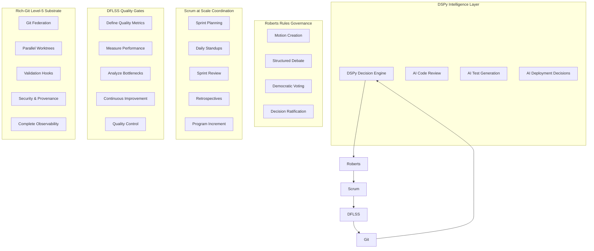

# E2E DevOps Loop Architecture
## DSPy + Roberts Rules + Scrum at Scale + DFLSS + Rich-Git Level-5

**Vision**: Autonomous, democratic, quality-driven DevOps ecosystem using Git as the universal substrate

---

## 🏗️ Architecture Overview



---

## 🔄 Complete E2E DevOps Loop

### Phase 1: Sprint Planning & Feature Creation
**Actors**: Product Owner, Scrum Masters, Dev Teams  
**Git Operations**: `submodule add`, `worktree add`, `remote add`

1. **DSPy Analysis**: AI analyzes backlog and suggests optimal sprint composition
2. **Roberts Rules**: Teams vote on sprint commitments and dependencies
3. **Scrum at Scale**: Cross-team planning creates federated feature branches
4. **DFLSS Define**: Quality metrics established for each feature
5. **Git Federation**: Domain-specific worktrees created for each team

### Phase 2: Development & Continuous Integration
**Actors**: Developers, AI Assistants, Quality Engineers  
**Git Operations**: `cherry-pick`, `rebase`, `merge`, `hook execution`

1. **DSPy Intelligence**: AI-powered code review and test generation
2. **Roberts Rules**: Merge request debates and approval voting
3. **Scrum Coordination**: Daily sync via Git federation status
4. **DFLSS Measure**: Real-time quality metrics collection
5. **Git Automation**: Hook pipeline ensures quality gates

### Phase 3: Integration & Testing
**Actors**: Integration Teams, Test Automation, Release Engineers  
**Git Operations**: `bundle`, `sparse-checkout`, `gc`, `bisect`

1. **DSPy Optimization**: AI identifies optimal integration strategy
2. **Roberts Rules**: Integration conflict resolution via structured debate
3. **Scrum Integration**: Cross-team integration planning
4. **DFLSS Analyze**: Performance bottleneck identification
5. **Git Performance**: Repository optimization for scale

### Phase 4: Release & Deployment
**Actors**: Release Managers, DevOps Engineers, Stakeholders  
**Git Operations**: `tag -s`, `notes`, `push --mirror`

1. **DSPy Decision**: AI recommends release readiness and strategy
2. **Roberts Rules**: Go/No-Go release voting with recorded rationale
3. **Scrum Review**: Sprint review and stakeholder feedback
4. **DFLSS Control**: Release quality validation and control
5. **Git Provenance**: Signed releases with complete audit trail

### Phase 5: Monitoring & Retrospection
**Actors**: SREs, Scrum Masters, Process Improvement Teams  
**Git Operations**: `reflog`, `notes --ref=metrics`, `prune`

1. **DSPy Learning**: AI analyzes cycle performance and suggests improvements
2. **Roberts Rules**: Process improvement motions and voting
3. **Scrum Retrospective**: Cross-team learning and adaptation
4. **DFLSS Improve**: Data-driven process optimization
5. **Git Maintenance**: Repository health and performance optimization

---

## 🎯 Git Command Coverage Matrix

| Phase | Git Level-5 Commands | Purpose | Integration Points |
|-------|---------------------|---------|-------------------|
| **Planning** | `submodule add`, `worktree add`, `remote add` | Federation setup | DSPy team optimization, Roberts voting on architecture |
| **Development** | `cherry-pick`, `rebase --rebase-merges`, `hook run` | Code integration | DSPy code review, Roberts merge voting |
| **Testing** | `bisect run`, `bundle create`, `sparse-checkout` | Quality assurance | DFLSS measurement, Scrum coordination |
| **Release** | `tag -s`, `notes add`, `push --mirror` | Deployment | Roberts release voting, DFLSS control gates |
| **Operations** | `gc --aggressive`, `reflog expire`, `prune` | Maintenance | DSPy optimization, DFLSS continuous improvement |

---

## 🧠 DSPy Integration Points

### 1. Intelligent Git Operation Selection
```python
class GitIntelligence(dspy.Module):
    def __init__(self):
        self.analyze_repo = dspy.ChainOfThought("repo_state -> optimal_git_operation")
        self.predict_conflicts = dspy.ChainOfThought("branch_diff -> conflict_probability")
        self.suggest_strategy = dspy.ChainOfThought("team_status -> integration_strategy")
    
    def forward(self, repo_state, team_status):
        operation = self.analyze_repo(repo_state=repo_state)
        conflicts = self.predict_conflicts(branch_diff=repo_state.diff)
        strategy = self.suggest_strategy(team_status=team_status)
        return operation, conflicts, strategy
```

### 2. AI-Powered Code Review
```python
class CodeReviewAI(dspy.Module):
    def __init__(self):
        self.review_code = dspy.ChainOfThought("code_diff -> review_feedback")
        self.generate_tests = dspy.ChainOfThought("code_changes -> test_cases")
        self.assess_risk = dspy.ChainOfThought("change_impact -> risk_level")
```

### 3. Deployment Decision Engine
```python
class DeploymentAI(dspy.Module):
    def __init__(self):
        self.assess_readiness = dspy.ChainOfThought("quality_metrics -> deployment_readiness")
        self.recommend_strategy = dspy.ChainOfThought("system_state -> deployment_strategy")
        self.predict_impact = dspy.ChainOfThought("change_scope -> business_impact")
```

---

## 🏛️ Roberts Rules Git Governance

### Motion Types for Git Operations
1. **Merge Motions**: "I move to merge feature/authentication into main"
2. **Release Motions**: "I move to release version 2.1.0 to production"
3. **Architecture Motions**: "I move to adopt microservices federation strategy"
4. **Process Motions**: "I move to require AI code review for all PRs"

### Voting Integration with Git
```python
class GitGovernance:
    def create_merge_motion(self, branch: str, target: str):
        """Create formal motion for merge with Roberts Rules process"""
        motion = Motion(
            type="merge",
            description=f"Merge {branch} into {target}",
            proposer=self.current_user,
            required_votes=self.calculate_quorum()
        )
        
        # Store motion in git notes
        subprocess.run([
            "git", "notes", "--ref=motions", "add", 
            "-m", motion.to_json(), "HEAD"
        ])
        
        return motion.id
    
    def conduct_debate(self, motion_id: str):
        """Structured debate following Roberts Rules"""
        # Time-boxed discussion with speaking order
        # Arguments stored in git notes for transparency
        
    def conduct_vote(self, motion_id: str):
        """Democratic voting with recorded results"""
        # Cryptographically signed votes
        # Results stored in git with full audit trail
```

---

## 🏃‍♂️ Scrum at Scale Git Coordination

### Sprint Coordination via Git Federation
```python
class ScrumGitCoordination:
    def plan_sprint(self, teams: List[Team]):
        """Plan sprint across federated teams"""
        for team in teams:
            # Create team-specific worktree
            subprocess.run([
                "git", "worktree", "add", 
                f"sprints/{team.name}", f"sprint/{self.current_sprint}"
            ])
            
            # Add team's domain pack
            subprocess.run([
                "git", "submodule", "add", 
                team.repository_url, f"domain_packs/{team.domain}"
            ])
    
    def daily_standup_sync(self):
        """Sync daily progress via Git federation"""
        # Fetch all team updates
        subprocess.run(["git", "fetch", "--all"])
        
        # Generate cross-team dependency report
        # Update sprint progress in git notes
        
    def sprint_review_integration(self):
        """Integrate sprint deliverables"""
        # Cherry-pick completed features
        # Rebase integration branches
        # Create release candidate tags
```

### Program Increment (PI) Planning
```python
class PIPlanning:
    def coordinate_dependencies(self, teams: List[Team]):
        """Map and resolve cross-team dependencies"""
        dependency_graph = self.analyze_git_dependencies()
        conflicts = self.identify_integration_points()
        
        # Create PI integration strategy
        # Establish merge sequences
        # Plan federation synchronization points
```

---

## 📊 DFLSS Quality Integration

### Define Phase - Quality Metrics
```python
class DFLSSQualityGates:
    def define_quality_metrics(self):
        """Define measurable quality criteria"""
        return QualityMetrics(
            code_coverage_threshold=80,
            performance_regression_limit=5,
            security_vulnerability_tolerance=0,
            documentation_completeness=90,
            test_automation_coverage=95
        )
```

### Measure Phase - Continuous Monitoring
```python
def measure_git_operations(self):
    """Measure Git operation performance and quality"""
    metrics = {
        "merge_time": self.measure_merge_duration(),
        "conflict_rate": self.calculate_conflict_frequency(),
        "build_success_rate": self.track_build_outcomes(),
        "deployment_frequency": self.measure_deployment_cadence(),
        "rollback_rate": self.track_rollback_frequency()
    }
    
    # Store metrics in git notes
    subprocess.run([
        "git", "notes", "--ref=metrics", "add",
        "-m", json.dumps(metrics), "HEAD"
    ])
```

### Analyze Phase - Bottleneck Identification
```python
def analyze_bottlenecks(self):
    """Identify process bottlenecks using git telemetry"""
    # Analyze git bisect results for recurring issues
    # Identify slow merge patterns
    # Find teams with high conflict rates
    # Discover integration anti-patterns
```

### Improve Phase - Continuous Enhancement
```python
def improve_processes(self):
    """Data-driven process improvements"""
    # Optimize git workflows based on metrics
    # Adjust team coordination patterns
    # Refine quality gates
    # Enhance automation
```

### Control Phase - Quality Assurance
```python
def control_quality(self):
    """Maintain quality standards through git controls"""
    # Automated quality gates in git hooks
    # Real-time monitoring dashboards
    # Exception handling and escalation
    # Continuous compliance checking
```

---

## 🔗 Integration Flow Example

### Feature Development E2E Flow

1. **Sprint Planning (Scrum + Roberts)**
   ```bash
   # DSPy recommends optimal team composition
   # Roberts Rules voting on sprint commitments
   git worktree add sprint/team-a sprint/2024-Q1
   git submodule add team-a-domain domain_packs/authentication
   ```

2. **Development (DSPy + Git)**
   ```bash
   # AI-powered development assistance
   git checkout -b feature/oauth-integration
   # DSPy generates tests and reviews code
   git commit -S -m "Add OAuth integration with AI-generated tests"
   ```

3. **Integration (Roberts + DFLSS)**
   ```bash
   # Roberts Rules debate for merge approval
   # DFLSS quality gates validation
   git rebase --rebase-merges main
   git merge --verify-signatures feature/oauth-integration
   ```

4. **Release (All Systems)**
   ```bash
   # DSPy assesses deployment readiness
   # Roberts Rules release voting
   # DFLSS final quality validation
   # Scrum cross-team coordination
   git tag -s v2.1.0 -m "Production release with full governance"
   git push --mirror production
   ```

---

## 🎯 Success Metrics

### Quantitative KPIs
- **Deployment Frequency**: Daily deployments with zero downtime
- **Lead Time**: Feature ideation to production in <2 weeks
- **Quality**: 99.9% automated quality gate pass rate
- **Democracy**: 100% major decisions via Roberts Rules voting
- **Efficiency**: 50% reduction in manual coordination overhead

### Qualitative Outcomes
- **Transparency**: All decisions recorded in Git with full audit trail
- **Autonomy**: Teams self-organize via AI-assisted Git operations
- **Quality**: Continuous improvement via DFLSS methodology
- **Scale**: Seamless coordination across 50+ teams
- **Trust**: Democratic governance builds organizational confidence

---

This architecture proves that **Git can serve as the universal substrate** for complex organizational processes, providing the foundation for truly autonomous, democratic, and quality-driven DevOps at scale.