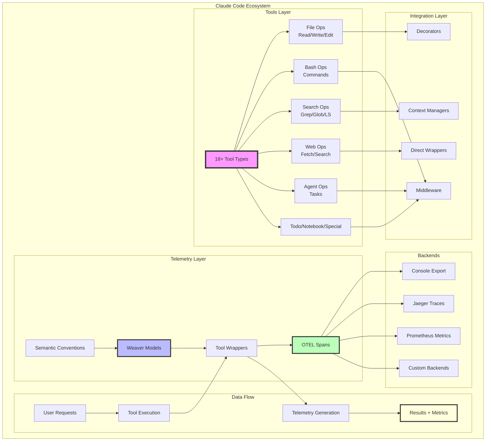
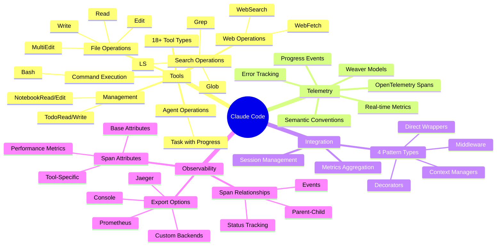

# Claude Code Complete Overview

## Master Architecture Diagram



## Key Metrics and Capabilities



## Complete Feature Matrix

| Category | Tools | Telemetry Features | Integration Options |
|----------|-------|--------------------|---------------------|
| **File Operations** | Read, Write, Edit, MultiEdit | Path, operation, size, lines affected | All patterns supported |
| **Bash Operations** | Command execution | Command, exit code, duration, timeout | Middleware preferred |
| **Search Operations** | Grep, Glob, LS | Pattern, path, results count | Context managers useful |
| **Web Operations** | WebFetch, WebSearch | URL, operation type, response size, cache | Direct wrapper common |
| **Agent Operations** | Task execution | ID, task, status, progress events | Middleware with events |
| **Todo Operations** | Read, Write | Todo count, status breakdown | Simple wrapper |
| **Notebook Operations** | Read, Edit cells | Path, cell ID, cell type | Specialized wrapper |
| **Special Operations** | Plan exit, Unknown | Custom attributes | Flexible handling |

## Benefits Summary

1. **Complete Observability** - Every tool action is tracked with detailed telemetry
2. **Type-Safe Models** - Weaver-generated Pydantic models ensure data consistency  
3. **Flexible Integration** - Multiple patterns for different use cases
4. **Performance Tracking** - Duration, success rates, and detailed metrics
5. **Error Visibility** - Automatic exception capture and status tracking
6. **Progress Monitoring** - Real-time progress events for long operations
7. **Standards Compliance** - Full OpenTelemetry compliance
8. **Easy Debugging** - Detailed spans with all context needed
9. **Metrics Aggregation** - Session and global metrics automatically collected
10. **Extensible Design** - Easy to add new tools and attributes

## Quick Start Integration

```python
# 1. Import the wrapper
from dslmodel.claude_code_weaver_wrapper import wrapped_tools

# 2. Use wrapped tools - telemetry is automatic!
result = wrapped_tools.read("/path/to/file.py")
result = wrapped_tools.bash("python test.py")
result = wrapped_tools.task("Analyze codebase", "Find security issues")

# 3. Get metrics summary
metrics = wrapped_tools.get_metrics_summary()
print(metrics)
```

That's it! Complete telemetry for all Claude Code operations with minimal code changes.