# Claude Code - Complete Mermaid Diagram Documentation

## 1. Tool Hierarchy and Categories

```mermaid
graph TD
    CC[Claude Code Tools] --> F[File Operations]
    CC --> B[Bash Operations]
    CC --> S[Search Operations]
    CC --> W[Web Operations]
    CC --> A[Agent Operations]
    CC --> T[Todo Operations]
    CC --> N[Notebook Operations]
    CC --> P[Special Operations]
    
    F --> F1[Read]
    F --> F2[Write]
    F --> F3[Edit]
    F --> F4[MultiEdit]
    
    B --> B1[Bash]
    
    S --> S1[Grep]
    S --> S2[Glob]
    S --> S3[LS]
    
    W --> W1[WebFetch]
    W --> W2[WebSearch]
    
    A --> A1[Task]
    
    T --> T1[TodoRead]
    T --> T2[TodoWrite]
    
    N --> N1[NotebookRead]
    N --> N2[NotebookEdit]
    
    P --> P1[exit_plan_mode]
    P --> P2[Unknown Tools]
    
    style CC fill:#f9f,stroke:#333,stroke-width:4px
    style F fill:#bbf,stroke:#333,stroke-width:2px
    style B fill:#fbf,stroke:#333,stroke-width:2px
    style S fill:#bfb,stroke:#333,stroke-width:2px
    style W fill:#ffb,stroke:#333,stroke-width:2px
    style A fill:#fbb,stroke:#333,stroke-width:2px
```

## 2. OpenTelemetry Span Structure

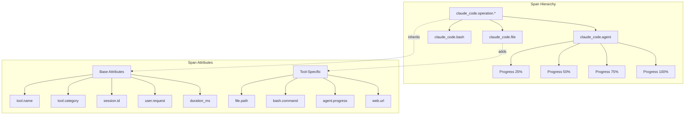

## 3. Telemetry Flow Architecture

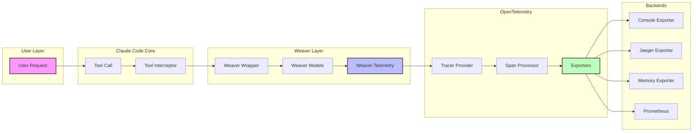

## 4. Tool Execution Lifecycle

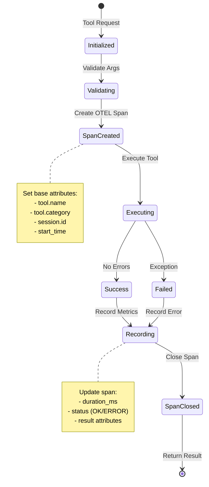

## 5. Integration Patterns

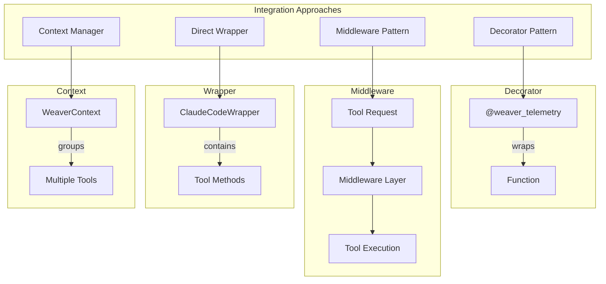

## 6. Data Flow Through System

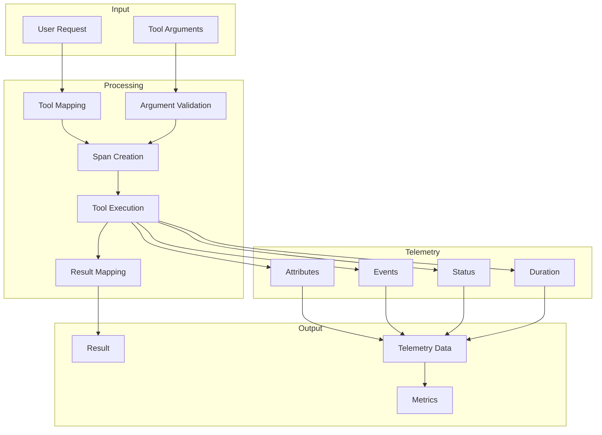

## 7. Error Handling Flow

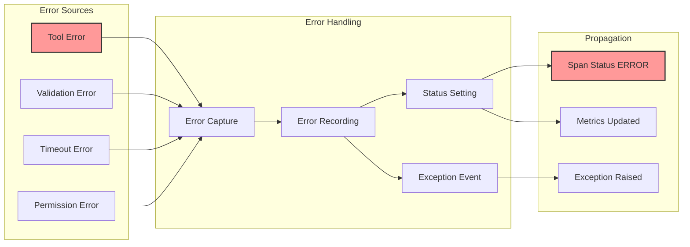

## 8. Attribute Inheritance Model

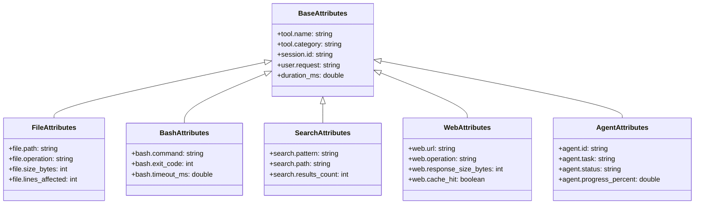

## 9. Session and Metrics Aggregation

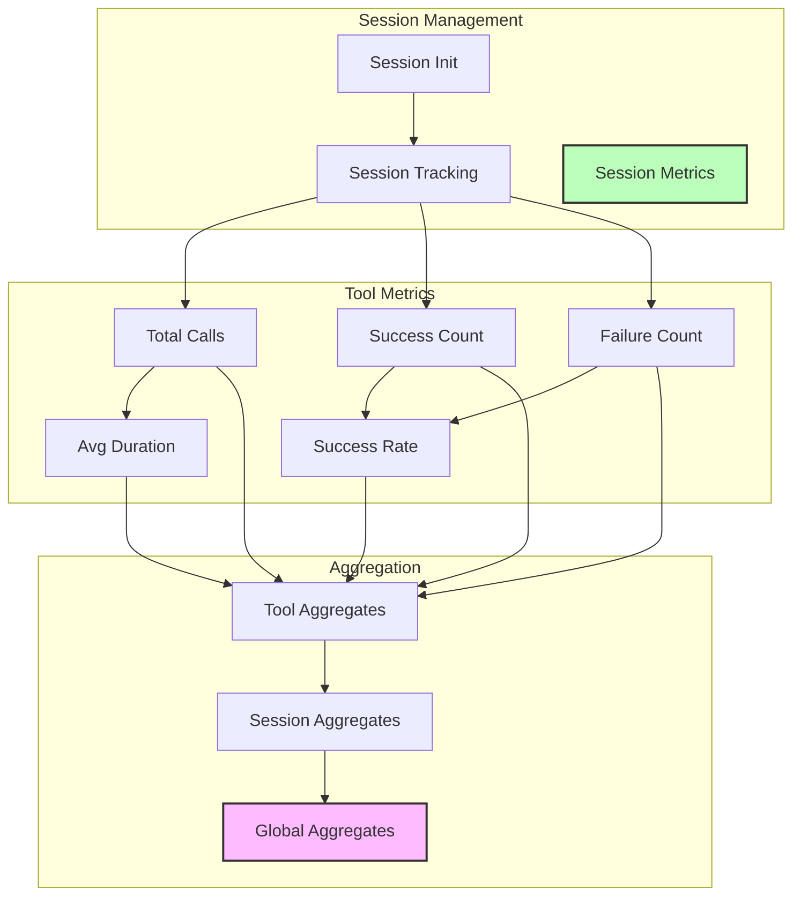

## 10. Complete System Architecture

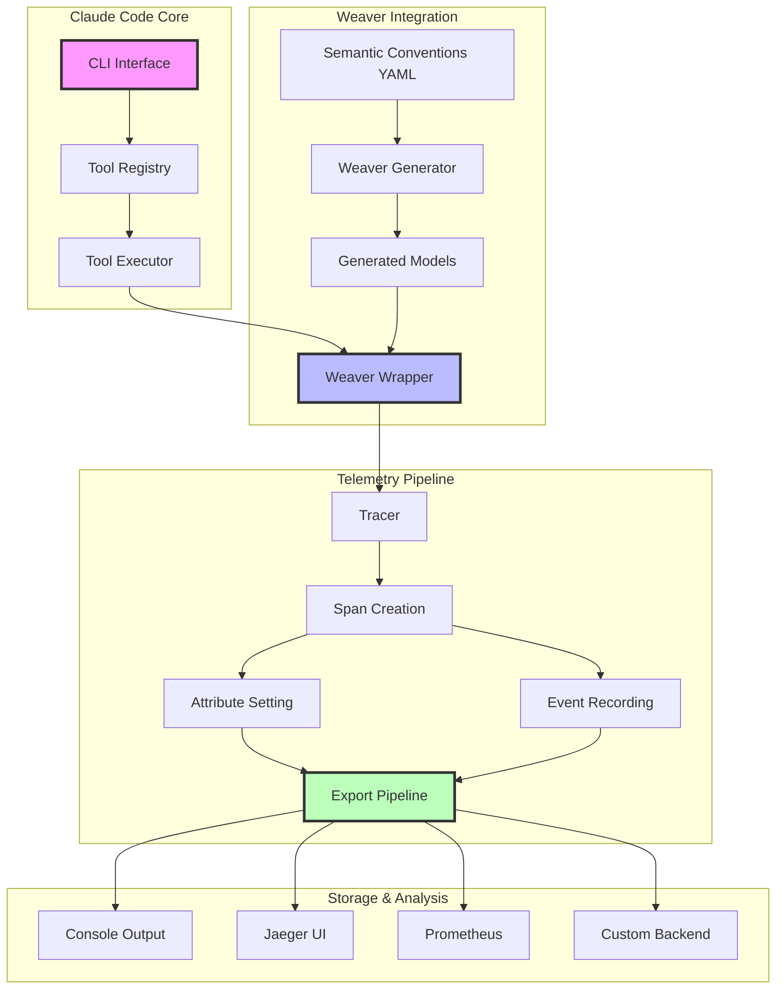

## 11. Tool Category Decision Tree

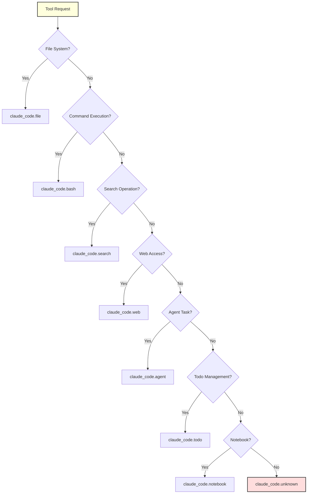

## 12. Progress Tracking for Long Operations

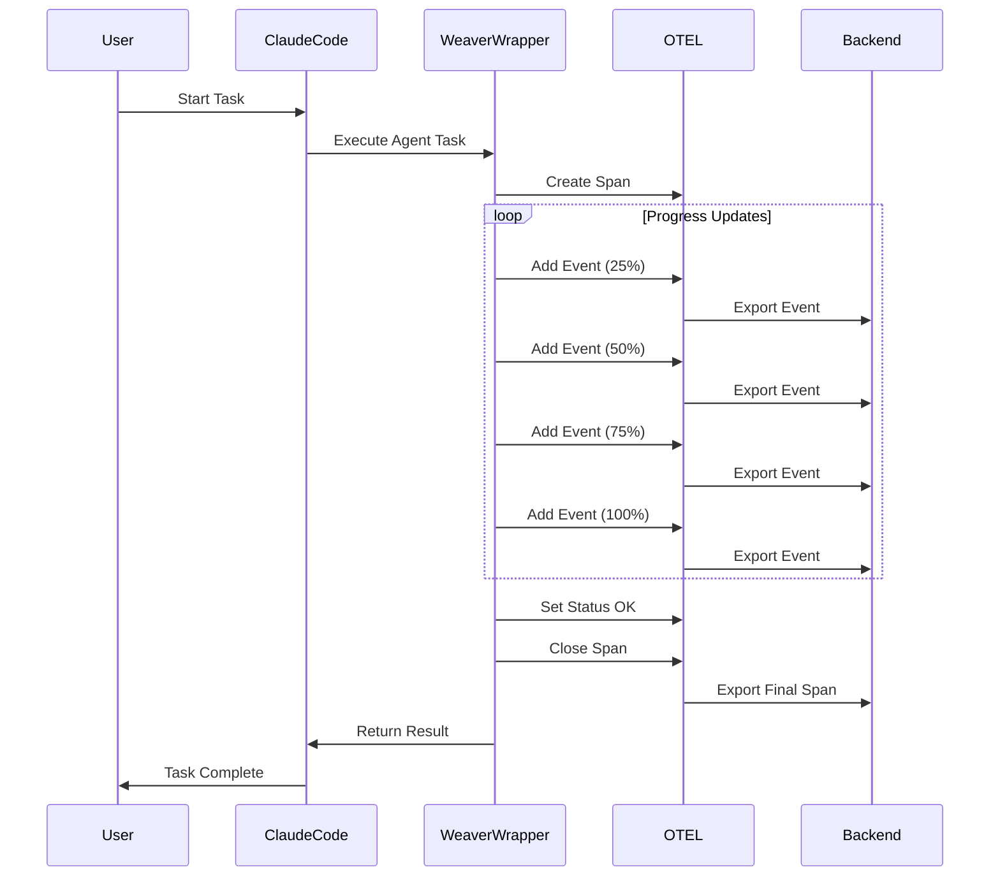

These diagrams provide a comprehensive visual overview of:
- Tool organization and hierarchy
- Telemetry architecture and flow
- Integration patterns and approaches
- Data flow through the system
- Error handling mechanisms
- Attribute inheritance model
- Session and metrics aggregation
- Complete system architecture
- Decision trees for tool categorization
- Progress tracking for long-running operations

Each diagram focuses on a specific aspect of Claude Code's architecture, making it easy to understand how all the pieces fit together.