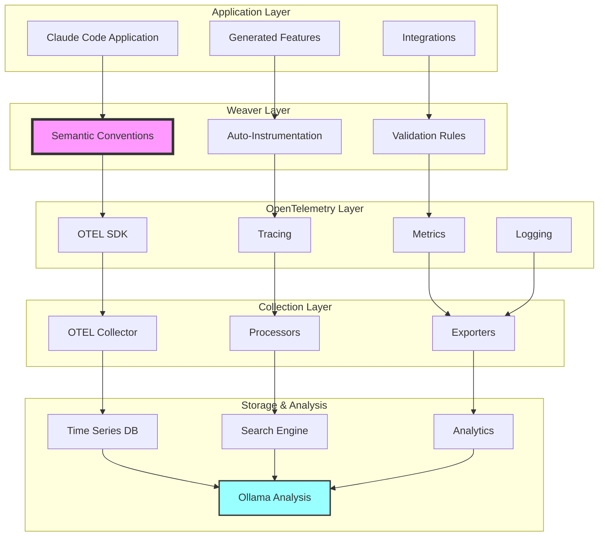

# Claude Code Weaver Integration - Complete System View

## Claude Code Weaver Ecosystem Overview

## Claude Code Telemetry-First Development Flow

## Claude Code Convention Categories

## Claude Code Weaver Command Matrix

## Claude Code Observability Stack

## Claude Code Feature Generation Workflow

## Claude Code Evolution System with Weaver

## Claude Code Quality Assurance with Weaver

## Summary: Claude Code + Weaver = Telemetry-First Development

This comprehensive integration shows how Weaver transforms Claude Code into a truly **telemetry-first development platform**:

### 🎯 **Key Benefits**

1. **Define Once, Generate Everything**: Semantic conventions drive all artifact generation
2. **Type-Safe Observability**: Generated Pydantic models ensure type safety
3. **Automatic Instrumentation**: OTEL integration is generated, not hand-coded
4. **Consistent Standards**: All telemetry follows OpenTelemetry conventions
5. **Evolution-Ready**: Changes to conventions automatically propagate
6. **Quality Assurance**: Built-in validation at every level
7. **Multi-Language Support**: Same conventions generate for different languages
8. **Documentation-Driven**: Generated docs stay in sync with code

### 🧬 **Architecture Patterns**

- **Convention-Driven Architecture**: Semantic conventions as single source of truth
- **Generated Infrastructure**: Templates generate boilerplate automatically
- **Observability by Design**: Telemetry is architected, not added later
- **Continuous Evolution**: System self-improves based on telemetry insights
- **Validation Everywhere**: Multiple validation layers ensure quality
- **Plugin Extensibility**: Custom generators for specific needs

### 🚀 **Developer Experience**

- Start with telemetry design, not code
- Generate complete features from specifications
- Built-in observability and monitoring
- Automatic documentation generation
- Type-safe development with validation
- Continuous improvement through evolution

Claude Code with Weaver represents the future of **telemetry-first software development** where observability drives the entire development lifecycle.