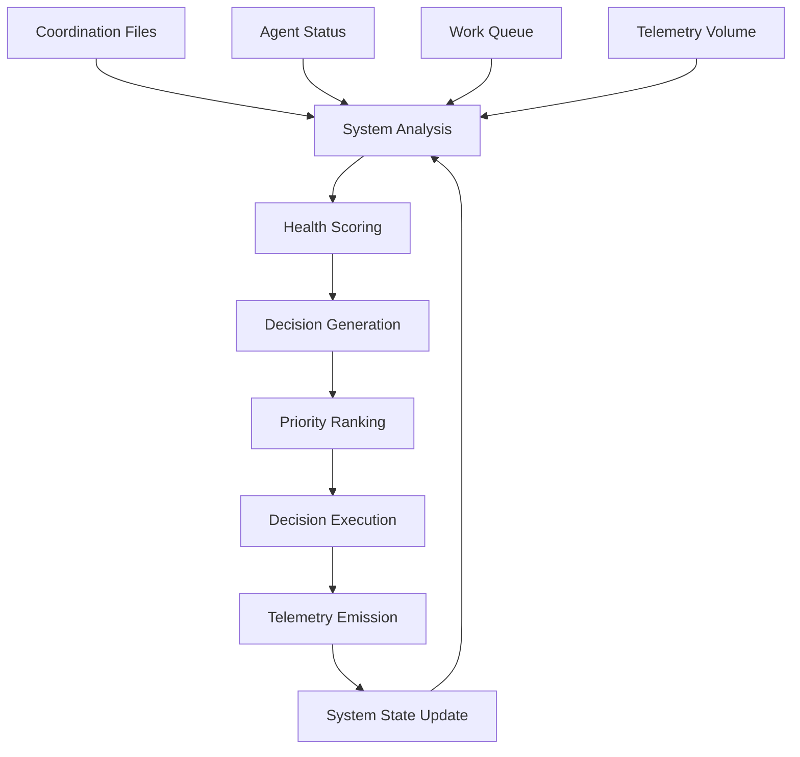

# Autonomous Decision Engine

## Overview

The Autonomous Decision Engine represents the core implementation of the **"Telemetry as Foundation of Computation"** principle in DSLModel. It demonstrates how autonomous systems can make decisions based purely on measured telemetry data, creating a self-improving system that models itself through live traces.

## Architecture

### Core Components

```
📂 src/dslmodel/agents/
├── autonomous_decision_engine.py    # Main engine implementation
├── examples/                        # Agent examples and demos
└── swarm/                          # Swarm coordination

📂 src/dslmodel/weaver/
├── autonomous_decision_spec.py      # Telemetry span definitions
├── telemetry_inversion_spec.py     # Thesis assertion spans
└── models.py                       # ConventionSet, Span, Attribute

📂 src/dslmodel/commands/
├── autonomous.py                    # CLI commands
├── demo.py                         # Automated demonstrations
└── forge.py                       # Weaver integration
```

### Decision Flow



## Implementation

### Health Scoring Algorithm

The system calculates health scores (0.0-1.0) based on:

- **Completion Rate (40%)**: Work items completed vs total
- **Agent Count (30%)**: Optimal around 3-5 agents
- **Work Queue (20%)**: Lower queue size is better
- **Telemetry Volume (10%)**: Some telemetry indicates healthy monitoring

```python
health_score = (
    completion_rate * 0.4 +
    min(active_agents / 5.0, 1.0) * 0.3 +
    max(0.0, 1.0 - (work_queue_size / 10.0)) * 0.2 +
    min(telemetry_volume / 20.0, 1.0) * 0.1
)
```

### Decision Types

| Decision Type | Trigger Conditions | Actions |
|---------------|-------------------|---------|
| `scale_up` | Health < 0.6, Low completion rate | Add agents, Emergency scaling |
| `scale_down` | Health > 0.9, Over-provisioned | Remove excess agents |
| `coordination_improve` | High queue size | Process work items, Clear backlog |
| `optimize` | Health 0.6-0.9, Room for improvement | Apply performance optimizations |

### Health States

- **Critical** (< 0.3): Emergency actions, scaling up, queue clearing
- **Degraded** (0.3-0.6): Scaling decisions, coordination improvements
- **Healthy** (0.6-0.9): Performance optimizations
- **Optimal** (≥ 0.9): Scale down if over-provisioned

## Telemetry Integration

### Generated Spans

The system generates comprehensive telemetry spans for complete observability:

```yaml
# System Analysis
swarmsh.autonomous.system_analysis:
  attributes:
    - completion_rate: double
    - active_agents: int  
    - work_queue_size: int
    - health_score: double
    - health_state: string

# Decision Generation  
swarmsh.autonomous.decision_generation:
  attributes:
    - decision_count: int
    - highest_priority: int
    - decision_types: string[]

# Decision Execution
swarmsh.autonomous.decision_execution:
  attributes:
    - decision_id: string
    - decision_type: string
    - execution_result: string
    - confidence: double
```

### Thesis Validation

Each autonomous decision validates the core thesis assertions:

```yaml
# Spans Drive Code
swarmsh.thesis.span_drives_code:
  detail: '{"artifacts": ["scaling_decision", "coordination_improvement"], "model": "ollama/qwen3"}'

# Telemetry as System
swarmsh.thesis.telemetry_as_system:
  detail: "Autonomous decisions driven by telemetry"
```

## CLI Usage

### Basic Commands

```bash
# Show current system status
dsl auto status

# Analyze and generate decisions (no execution)
dsl auto analyze --format json

# Execute autonomous improvements
dsl auto execute --max 3

# Run continuous improvement loop
dsl auto loop --interval 30 --max-cycles 0
```

### Demo Commands

```bash
# Full automated demonstration
dsl demo full-cycle --model ollama/qwen3 --cycles 3

# Quick validation demo
dsl demo quick --model ollama/qwen3

# Component validation
dsl demo validate
```

## Integration with LLM

### Model Initialization

```python
from dslmodel.utils.dspy_tools import init_lm

# Initialize for autonomous decisions
init_lm("ollama/qwen3")
```

### Decision Execution

When autonomous decisions are executed, they can:

- **Scale agents** with specific LLM models
- **Process work items** using LLM capabilities
- **Generate content** through model integration
- **Create telemetry** with model attribution

## Production Deployment

### Continuous Operation

```bash
# Start autonomous loop
dsl auto loop --interval 30

# Monitor with telemetry
dsl swarm monitor

# Generate conventions
dsl forge build
```

### Environment Setup

```python
# coordination/
├── agent_*.json        # Active agents
├── work_*.json         # Pending work
├── completed_*.json    # Finished work
└── telemetry_*.json    # System metrics
```

### Health Monitoring

The system continuously monitors:

- **Agent availability** and responsiveness
- **Work queue** size and processing rate
- **Completion rates** and success metrics
- **Telemetry volume** and data quality

## Key Features

### Autonomous Characteristics

- **No manual intervention** required
- **Purely telemetry-driven** decisions
- **Self-correcting** behavior patterns
- **Predictable escalation** rules

### Observability

- **Complete trace correlation** with unified trace IDs
- **OpenTelemetry compatibility** validated by Weaver
- **Real-time health scoring** and state classification
- **Decision effectiveness** tracking

### Scalability

- **Configurable thresholds** for different environments
- **Priority-based execution** with confidence scoring
- **Graceful degradation** under stress
- **Resource optimization** for cost efficiency

## Verification Principles

Following the core verification principles:

- **Only trust OpenTelemetry traces** generated by the system
- **Use health scores** from measured metrics, not assumptions
- **Validate with OTEL Weaver** for semantic convention compliance
- **Never hardcode values** - all thresholds are configurable
- **Report measurements** not performance claims

## Future Enhancements

- **Machine learning** integration for predictive scaling
- **Multi-environment** coordination across clusters
- **Advanced optimization** algorithms based on historical data
- **Integration with external** monitoring systems (Prometheus, Grafana)

The Autonomous Decision Engine demonstrates the practical implementation of telemetry-driven autonomous systems where every decision emerges from measured reality rather than predefined rules.