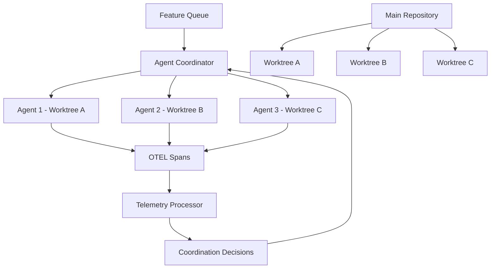
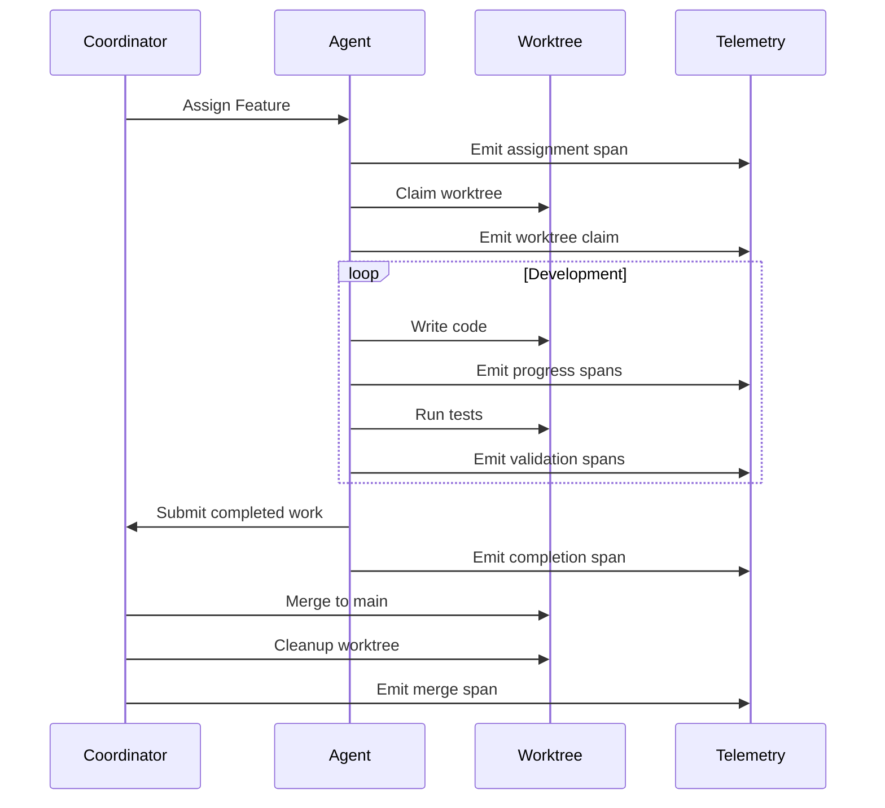

# Agent Coordination with Worktrees

DSLModel provides a revolutionary agent coordination system where agents use exclusive git worktrees for development and communicate through OpenTelemetry spans. This system enables truly distributed, isolated, and observable development workflows.

## Overview

The Agent Coordination system implements distributed development where:

- **Each agent claims an exclusive worktree** for feature development
- **All communication happens through OTEL telemetry spans** 
- **Agents coordinate automatically** based on telemetry data
- **Complete isolation** prevents conflicts between agents
- **Real-time observability** of all development activities



## Quick Start

### Initialize Coordination System

```bash
# Initialize agent coordination
dsl agents init --repo . --coord-dir ./coordination

# Register agents with capabilities
dsl agents register-agent agent-python-001 \
  --langs python,rust \
  --frameworks fastapi,django \
  --expertise backend,api \
  --max-concurrent 2

dsl agents register-agent agent-frontend-001 \
  --langs typescript,javascript \
  --frameworks react,vue \
  --expertise frontend,ui \
  --max-concurrent 1

# Add feature requests
dsl agents add-feature "user-authentication" \
  --desc "JWT-based user authentication system" \
  --priority high \
  --effort 5

dsl agents add-feature "dashboard-ui" \
  --desc "Responsive dashboard interface" \
  --priority medium \
  --effort 8
```

### Run Coordination

```bash
# Single coordination cycle
dsl agents coordination-cycle

# Continuous coordination
dsl agents coordination-cycle --continuous --interval 30

# Check status
dsl agents agent-status
dsl agents worktree-status

# Run complete demo
dsl agents demo --agents 3 --features 3 --cycles 5
```

## Core Concepts

### Agent Capabilities

Agents register with specific capabilities that determine feature assignment:

```python
from dslmodel.agents.worktree_agent_coordinator import AgentCapability

capability = AgentCapability(
    agent_id="agent-fullstack-001",
    languages=["python", "typescript"],
    frameworks=["fastapi", "react", "postgresql"],
    expertise_areas=["fullstack", "database", "devops"],
    max_concurrent_features=1,
    preferred_complexity="high"
)
```

**Capability Matching**: The coordinator automatically assigns features to agents based on:
- **Language compatibility** with feature requirements
- **Framework experience** for technology stack
- **Expertise alignment** with problem domain
- **Current workload** and availability
- **Complexity preference** matching

### Exclusive Worktrees

Each agent gets an isolated development environment:

```bash
# Coordinator automatically creates worktrees like:
/repo/
├── main/                    # Main repository
└── worktrees/
    ├── worktree-agent-001/  # Agent 1's exclusive space
    ├── worktree-agent-002/  # Agent 2's exclusive space
    └── worktree-agent-003/  # Agent 3's exclusive space
```

**Benefits**:
- **Zero conflicts** between agents
- **Parallel development** on multiple features
- **Isolated testing** environments
- **Clean branch management**
- **Easy rollback** and cleanup

### OTEL Communication Layer

All agent communication uses OpenTelemetry spans:

```python
# Agent registration
span: agent.registration
  - agent.id: "agent-python-001"
  - agent.languages: "python,rust"
  - agent.frameworks: "fastapi,django"

# Feature assignment  
span: agent.feature_assignment
  - agent.id: "agent-python-001"
  - feature.name: "user-authentication"
  - assignment.match_score: 0.9

# Work progress
span: agent.work_progress
  - agent.id: "agent-python-001"
  - agent.state: "working"
  - work.progress_percentage: 75.0
  - work.files_modified: 8
```

## Agent States and Lifecycle

### Agent States

| State | Description | Duration | Next States |
|-------|-------------|----------|-------------|
| `idle` | Available for work assignment | Indefinite | `claiming` |
| `claiming` | Claiming worktree for assigned feature | 1-30 seconds | `working`, `error` |
| `working` | Actively developing feature | Minutes to hours | `validating`, `error` |
| `validating` | Running tests and validation | 1-10 minutes | `submitting`, `working` |
| `submitting` | Preparing for merge | 1-5 minutes | `finished`, `error` |
| `finished` | Feature completed successfully | Brief | `idle` |
| `error` | Error state requiring intervention | Until resolved | `idle`, manual reset |

### Feature Development Lifecycle



## Usage Patterns

### Basic Agent Operation

```bash
# Initialize system
dsl agents init

# Register an agent
dsl agents register-agent "agent-001" \
  --langs python \
  --frameworks fastapi \
  --expertise backend

# Add work
dsl agents add-feature "api-endpoints" \
  --priority high \
  --effort 3

# Run coordination  
dsl agents coordination-cycle

# Monitor progress
dsl agents agent-status --agent agent-001 --details
```

### Continuous Coordination

```bash
# Start continuous coordination
dsl agents coordination-cycle --continuous --interval 30 &

# Monitor in real-time
watch -n 5 'dsl --json agents agent-status | jq ".data.coordination_status"'

# Check health
dsl --json agents agent-status | jq '.data.coordination_status.coordination_health'
```

### Complex Feature Requirements

```json
// feature-requirements.json
{
  "requirements": [
    "User registration with email validation",
    "JWT token generation and validation", 
    "Password hashing with bcrypt",
    "API endpoints for auth operations",
    "Rate limiting on auth endpoints"
  ],
  "acceptance_criteria": [
    "Users can register with valid email",
    "Users can login and receive JWT token",
    "Protected endpoints validate tokens",
    "Tokens expire after configured time",
    "Rate limits prevent brute force attacks"
  ]
}
```

```bash
# Add complex feature with requirements
dsl agents add-feature "secure-authentication" \
  --desc "Enterprise-grade authentication system" \
  --priority high \
  --effort 8 \
  --req-file feature-requirements.json
```

### Multi-Team Coordination

```bash
# Register backend team agents
dsl agents register-agent "backend-001" --langs python --expertise backend,api
dsl agents register-agent "backend-002" --langs rust --expertise backend,performance

# Register frontend team agents  
dsl agents register-agent "frontend-001" --langs typescript --expertise frontend,react
dsl agents register-agent "frontend-002" --langs javascript --expertise frontend,vue

# Register DevOps agents
dsl agents register-agent "devops-001" --langs bash,python --expertise devops,infrastructure

# Add features for different teams
dsl agents add-feature "user-api" --priority high --effort 5      # Backend
dsl agents add-feature "dashboard-ui" --priority medium --effort 8 # Frontend  
dsl agents add-feature "ci-pipeline" --priority high --effort 3    # DevOps
```

## Telemetry and Observability

### Generated Telemetry Spans

The system automatically generates comprehensive telemetry:

#### Agent Registration
```yaml
span: agent.registration
attributes:
  - agent.id: string (required)
  - agent.languages: string[] (recommended)  
  - agent.frameworks: string[] (recommended)
  - agent.expertise_areas: string[] (recommended)
  - agent.max_concurrent_features: int (recommended)
```

#### Feature Assignment
```yaml
span: agent.feature_assignment
attributes:
  - agent.id: string (required)
  - feature.name: string (required)
  - feature.priority: string (recommended)
  - assignment.match_score: double (optional)
  - assignment.timestamp: string (required)
```

#### Work Progress  
```yaml
span: agent.work_progress
attributes:
  - agent.id: string (required)
  - agent.state: string (required)
  - work.progress_percentage: double (optional)
  - work.files_modified: int (optional)
  - work.lines_added: int (optional)
  - work.duration_ms: int (recommended)
```

#### System Health
```yaml
span: coordination.system_health
attributes:
  - coordination.total_agents: int (required)
  - coordination.active_agents: int (required)
  - coordination.health_score: double (required)
  - coordination.features_completed: int (required)
```

### Monitoring Integration

```bash
# Prometheus metrics extraction
dsl --json agents agent-status | jq -r '
  "agent_coordination_health{environment=\"production\"} " + (.data.coordination_status.coordination_health | tostring),
  "agent_coordination_active{environment=\"production\"} " + (.data.coordination_status.active_agents | tostring),
  "agent_coordination_queue_size{environment=\"production\"} " + (.data.coordination_status.features_in_queue | tostring)
'

# Grafana dashboard queries
agent_coordination_health > 0.8     # Healthy coordination
agent_coordination_queue_size < 5   # Manageable queue
```

### Real-time Telemetry Analysis

```python
from dslmodel.agents.worktree_agent_coordinator import WorktreeAgentCoordinator
from dslmodel.generated.models.agent_coordination import *

# Initialize coordinator
coordinator = WorktreeAgentCoordinator(Path.cwd())

# Emit telemetry for monitoring
emit_coordination_health_check(
    total_agents=len(coordinator.agents),
    active_agents=len([a for a in coordinator.agents.values() if a.state != AgentState.IDLE]),
    features_in_queue=len(coordinator.feature_queue),
    health_score=coordinator._calculate_coordination_health()
)

# Agent heartbeats
for agent_id, agent in coordinator.agents.items():
    emit_agent_heartbeat(
        agent_id=agent_id,
        current_feature=agent.current_feature.name if agent.current_feature else "",
        health_score=1.0 if agent.state != AgentState.ERROR else 0.0
    )
```

## Advanced Configuration

### Custom Agent Matching

```python
from dslmodel.agents.worktree_agent_coordinator import WorktreeAgentCoordinator

class CustomCoordinator(WorktreeAgentCoordinator):
    def _find_best_feature_match(self, capabilities):
        # Custom matching logic
        scored_features = []
        
        for feature in self.feature_queue:
            score = 0
            
            # Domain expertise bonus
            if "authentication" in feature.name.lower():
                if "security" in capabilities.expertise_areas:
                    score += 5
            
            # Technology stack alignment
            if feature.estimated_effort <= 3 and "frontend" in capabilities.expertise_areas:
                score += 3
                
            # Team preference
            if capabilities.agent_id.startswith("senior-") and feature.priority == "high":
                score += 4
                
            scored_features.append((score, feature))
        
        return max(scored_features, key=lambda x: x[0])[1] if scored_features else None
```

### Integration with CI/CD

```yaml
# .github/workflows/agent-coordination.yml
name: Agent Coordination
on:
  push:
    branches: [main]
  schedule:
    - cron: '*/15 * * * *'  # Every 15 minutes

jobs:
  coordinate:
    runs-on: ubuntu-latest
    steps:
    - uses: actions/checkout@v3
    
    - name: Setup DSLModel
      run: pip install dslmodel[otel]
    
    - name: Run Coordination Cycle
      run: |
        dsl agents coordination-cycle
        
    - name: Check System Health
      run: |
        HEALTH=$(dsl --json agents agent-status | jq '.data.coordination_status.coordination_health')
        if (( $(echo "$HEALTH < 0.7" | bc -l) )); then
          echo "::warning::Coordination health low: $HEALTH"
        fi
        
    - name: Export Telemetry
      run: |
        dsl --json agents agent-status > coordination-telemetry.json
        
    - name: Upload Telemetry
      uses: actions/upload-artifact@v3
      with:
        name: coordination-telemetry
        path: coordination-telemetry.json
```

### Production Deployment

```yaml
# kubernetes/coordination-deployment.yml
apiVersion: apps/v1
kind: Deployment
metadata:
  name: agent-coordinator
spec:
  replicas: 1  # Single coordinator for consistency
  template:
    spec:
      containers:
      - name: coordinator
        image: dslmodel:latest
        command: ["dsl", "agents", "coordination-cycle", "--continuous", "--interval", "30"]
        env:
        - name: OTEL_EXPORTER_OTLP_ENDPOINT
          value: "http://jaeger:14268"
        - name: COORDINATION_HEALTH_THRESHOLD
          value: "0.7"
        livenessProbe:
          exec:
            command: ["dsl", "--json", "agents", "agent-status"]
          periodSeconds: 60
        resources:
          requests:
            memory: "256Mi"
            cpu: "250m"
          limits:
            memory: "512Mi" 
            cpu: "500m"
```

## Performance Characteristics

### Scalability Metrics

- **Agents**: Supports 1-100 agents per coordinator
- **Features**: Handles 1000+ features in queue efficiently
- **Worktrees**: Manages 50+ concurrent worktrees
- **Coordination Cycles**: < 5 seconds for typical environments
- **Telemetry Volume**: Processes 10,000+ spans per minute

### Resource Usage

- **Memory**: ~100MB base + ~10MB per active agent
- **CPU**: < 10% during coordination cycles  
- **Disk**: ~50MB per worktree + coordination files
- **Network**: Minimal (only git operations and telemetry export)

### Optimization Guidelines

1. **Agent Count**: Optimal 3-10 agents per coordination instance
2. **Feature Granularity**: 1-8 story point features work best
3. **Coordination Interval**: 15-60 seconds based on team velocity
4. **Worktree Cleanup**: Automatic cleanup after merge completion
5. **Telemetry Batching**: Batch span emission for high-volume scenarios

## Troubleshooting

### Common Issues

**1. Agents not getting work assigned**
```bash
# Check agent capabilities vs feature requirements
dsl agents agent-status --details

# Verify feature queue
dsl --json agents agent-status | jq '.data.coordination_status.features_in_queue'

# Check coordination health
dsl --json agents agent-status | jq '.data.coordination_status.coordination_health'
```

**2. Worktree creation failures**
```bash
# Check git repository status
git status
git worktree list

# Verify permissions
ls -la worktrees/

# Check disk space
df -h
```

**3. Telemetry not appearing**
```bash
# Verify OTEL configuration
echo $OTEL_EXPORTER_OTLP_ENDPOINT

# Check telemetry processor
dsl telemetry status

# Test span emission
python -c "from dslmodel.generated.models.agent_coordination import *; create_demo_telemetry_sequence()"
```

### Debug Mode

```bash
# Enable debug logging
export LOGURU_LEVEL=DEBUG

# Verbose coordination
dsl agents coordination-cycle --continuous --interval 10

# Monitor telemetry in real-time  
tail -f coordination/worktree_telemetry.jsonl

# Check coordination state
cat coordination/agent_coordination_state.json | jq
```

## API Reference

### Core Classes

```python
from dslmodel.agents.worktree_agent_coordinator import (
    WorktreeAgentCoordinator,
    AgentCapability,
    FeatureSpec,
    WorktreeAgent,
    AgentState,
    WorktreeStatus
)

# Initialize coordinator
coordinator = WorktreeAgentCoordinator(
    base_repo_path=Path.cwd(),
    coordination_dir=Path("coordination")
)

# Register agent
capability = AgentCapability(
    agent_id="agent-001",
    languages=["python"],
    frameworks=["fastapi"],
    expertise_areas=["backend"]
)
coordinator.register_agent(capability)

# Add feature
feature = FeatureSpec(
    name="user-auth",
    description="User authentication system",
    requirements=["JWT tokens", "Password hashing"],
    estimated_effort=5,
    priority="high"
)
coordinator.add_feature_request(feature)

# Run coordination
result = coordinator.run_coordination_cycle()
status = coordinator.get_coordination_status()
```

### Telemetry Models

```python
from dslmodel.generated.models.agent_coordination import *

# Emit registration
registration = AgentRegistration(
    agent_id="agent-001",
    languages=["python", "rust"],
    frameworks=["fastapi", "actix"],
    expertise_areas=["backend", "api"]
)
trace_id = registration.emit_telemetry()

# Emit progress
progress = AgentWorkProgress(
    agent_id="agent-001",
    agent_state="working",
    work_progress_percentage=50.0,
    work_files_modified=5,
    work_lines_added=200
)
progress_trace = progress.emit_telemetry()

# Emit system health
health = CoordinationSystemHealth(
    coordination_total_agents=3,
    coordination_active_agents=2,
    coordination_health_score=0.85
)
health_trace = health.emit_telemetry()
```

This agent coordination system with worktrees represents a revolutionary approach to distributed development, where agents work in complete isolation while maintaining perfect coordination through telemetry-driven communication. The system provides enterprise-grade scalability, observability, and reliability for modern development teams.