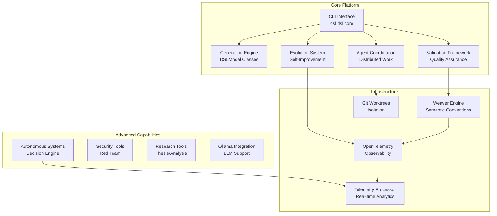
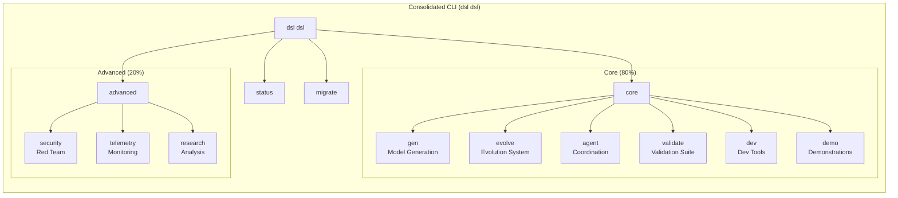
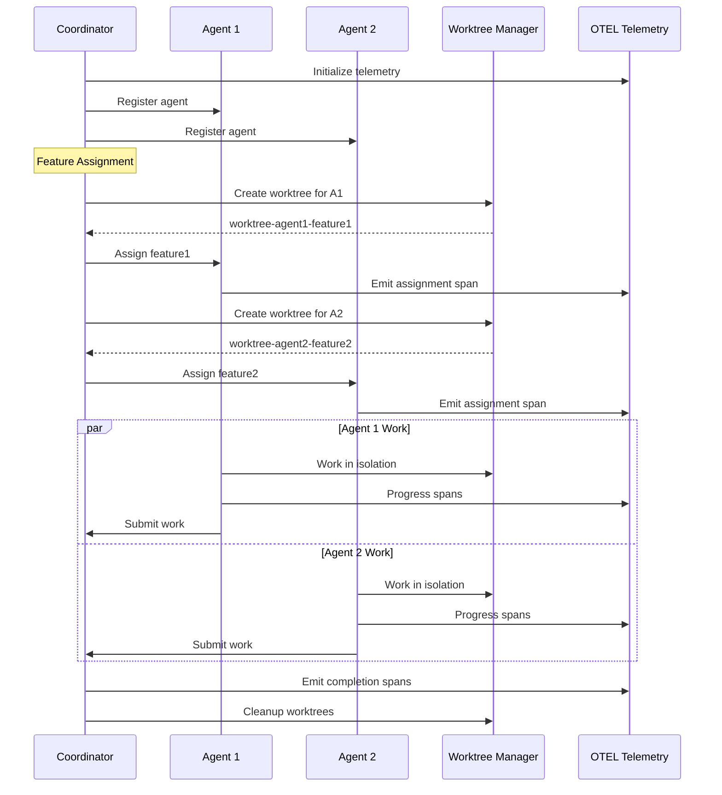
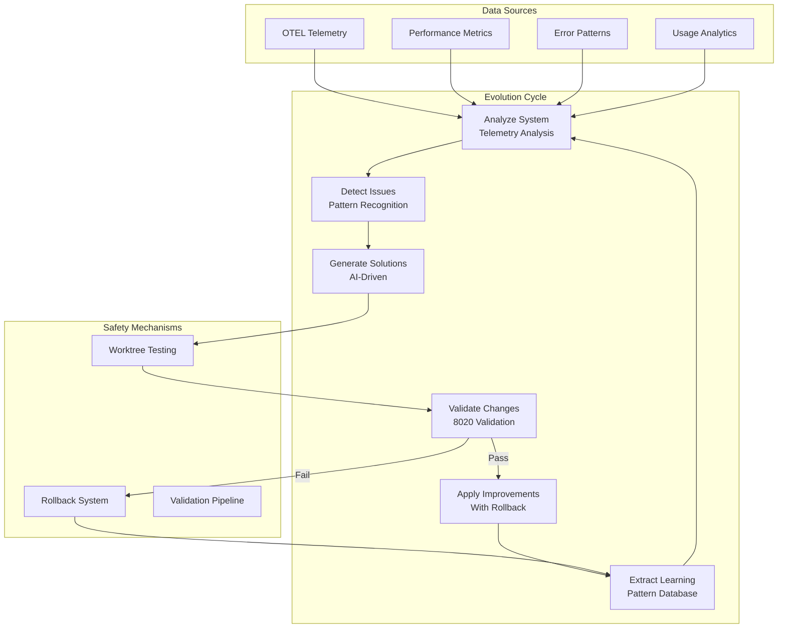
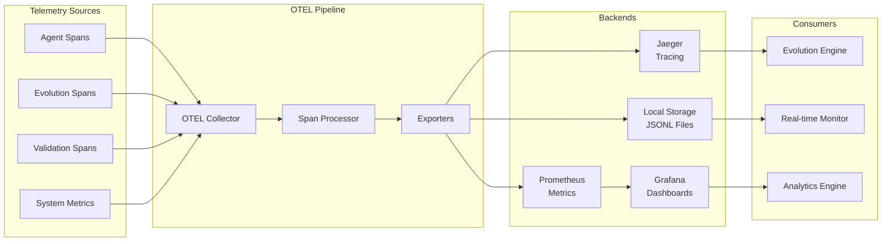
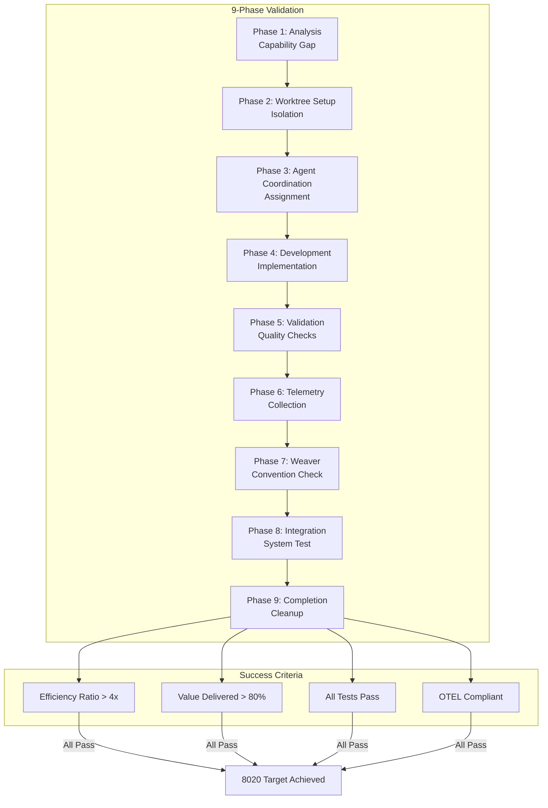
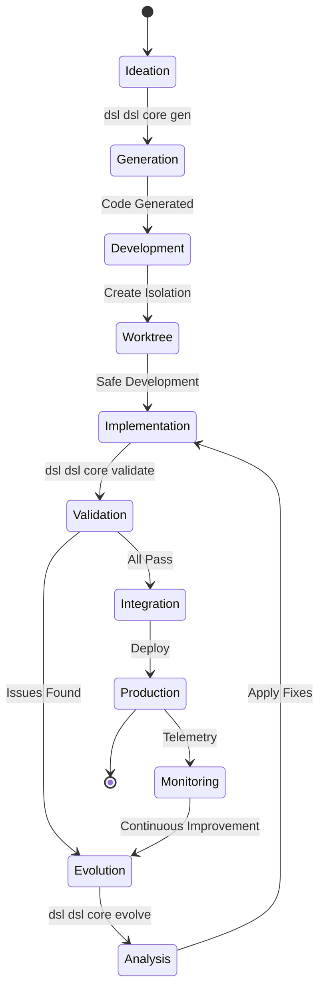
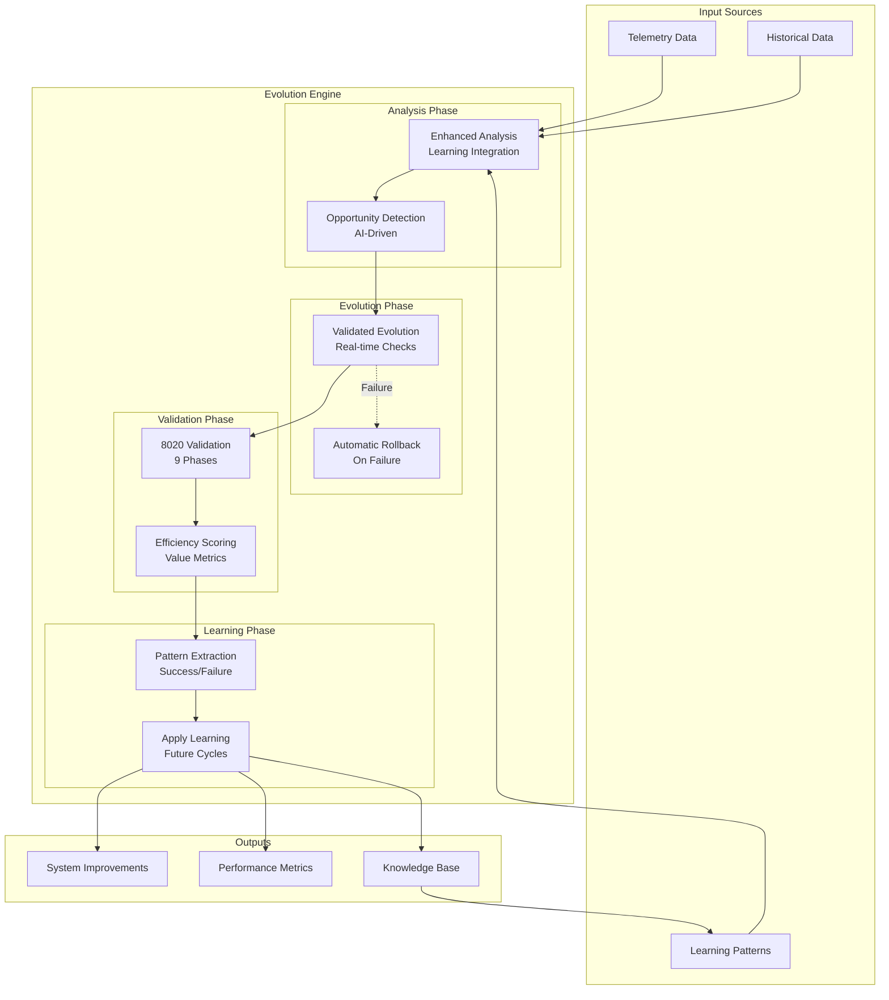
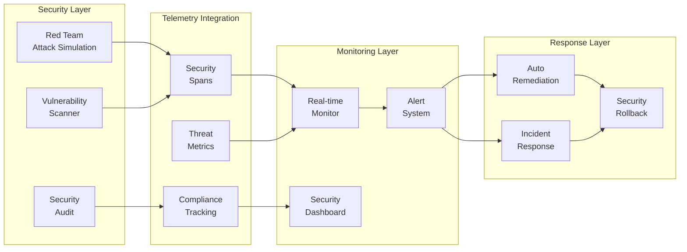
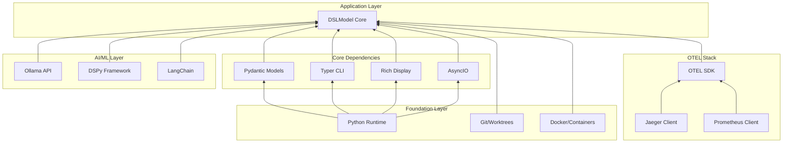

# DSLModel Architecture Diagrams

## 1. Overall System Architecture

## 2. CLI Command Structure (80/20 Consolidation)

## 3. Agent Coordination System

## 4. Evolution System Flow

## 5. OTEL Telemetry Architecture

## 6. Validation Pipeline (8020)

## 7. Development Workflow

## 8. Unified 8020 Evolution Engine

## 9. Security and Monitoring Architecture

## 10. System Component Dependencies

