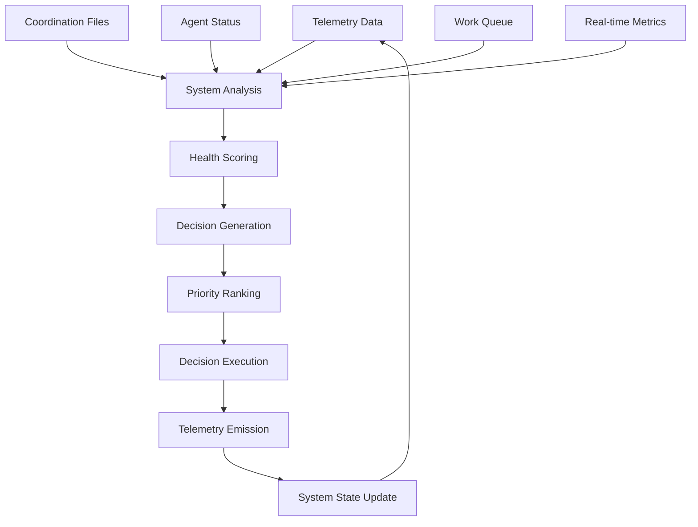

# Autonomous Operations

DSLModel provides a comprehensive autonomous decision engine that enables self-healing, self-scaling, and self-optimizing systems based purely on telemetry data. This document covers the autonomous capabilities that demonstrate "Telemetry as Foundation of Computation."

## Overview

The Autonomous Decision Engine represents the core implementation of telemetry-driven autonomous systems. It makes decisions based purely on measured telemetry data, creating a self-improving system that models itself through live traces.



## Quick Start

```bash
# Check autonomous system status
dsl auto status

# Analyze system and generate decisions (no execution)
dsl auto analyze --format json

# Execute autonomous improvements (up to 3 decisions)
dsl auto execute --max 3

# Run continuous autonomous loop
dsl auto loop --interval 30 --max-cycles 0

# Enable auto-remediation integration
dsl telemetry enable-remediation --live
```

## Core Concepts

### Health Scoring Algorithm

The system calculates health scores (0.0-1.0) based on four weighted metrics:

```python
health_score = (
    completion_rate * 0.4 +                           # 40% weight
    min(active_agents / 5.0, 1.0) * 0.3 +            # 30% weight
    max(0.0, 1.0 - (work_queue_size / 10.0)) * 0.2 + # 20% weight
    min(telemetry_volume / 20.0, 1.0) * 0.1          # 10% weight
)
```

**Metric Explanations**:
- **Completion Rate (40%)**: Percentage of work items successfully completed
- **Agent Count (30%)**: Optimal range around 3-5 agents, scales with demand
- **Work Queue (20%)**: Lower queue size indicates better throughput
- **Telemetry Volume (10%)**: Some telemetry indicates healthy monitoring

### Health States

| State | Score Range | Characteristics | Actions |
|-------|-------------|-----------------|---------|
| **Critical** | < 0.3 | System failing, emergency state | Emergency scaling, queue clearing |
| **Degraded** | 0.3-0.6 | Performance issues, needs attention | Scaling decisions, coordination improvements |
| **Healthy** | 0.6-0.9 | Normal operation, room for optimization | Performance optimizations |
| **Optimal** | ≥ 0.9 | Excellent performance, may be over-provisioned | Scale down if cost-effective |

### Decision Types

| Decision Type | Trigger Conditions | Actions | Example |
|---------------|-------------------|---------|---------|
| `scale_up` | Health < 0.6, Low completion rate | Add agents, Emergency scaling | Health 0.2 → Add 3 agents |
| `scale_down` | Health > 0.9, Over-provisioned | Remove excess agents | Health 0.95, 8 agents → Remove 3 |
| `coordination_improve` | High queue size, Backlog | Process work items, Clear backlog | Queue size 15 → Process 10 items |
| `optimize` | Health 0.6-0.9, Room for improvement | Apply performance optimizations | Tune agent efficiency |

## Implementation Details

### System Analysis

The autonomous engine continuously analyzes system state from multiple sources:

```python
from dslmodel.agents.autonomous_decision_engine import AutonomousDecisionEngine

# Initialize with coordination directory
engine = AutonomousDecisionEngine(Path("coordination"))

# Analyze current system state
metrics = engine.analyze_system_state()
print(f"Health: {metrics.health_score:.2f}")
print(f"State: {metrics.health_state}")
print(f"Agents: {metrics.active_agents}")
print(f"Queue: {metrics.work_queue_size}")
```

**Data Sources**:
- **Agent Files**: `coordination/agent_*.json` - Active agent status
- **Work Files**: `coordination/work_*.json` - Pending work items  
- **Completed Files**: `coordination/completed_*.json` - Finished work
- **Telemetry Files**: `coordination/telemetry_*.json` - System metrics

### Decision Generation

The engine generates prioritized decisions based on current system state:

```python
# Generate autonomous decisions
decisions = engine.make_autonomous_decisions(metrics)

for decision in decisions:
    print(f"Decision: {decision.type}")
    print(f"Priority: {decision.priority}")
    print(f"Confidence: {decision.confidence}")
    print(f"Rationale: {decision.rationale}")
```

**Decision Confidence Scoring**:
- **High Confidence (0.8-1.0)**: Clear indicators, safe to execute
- **Medium Confidence (0.6-0.8)**: Reasonable indicators, proceed with caution
- **Low Confidence (0.4-0.6)**: Uncertain indicators, manual review recommended
- **Very Low (<0.4)**: Insufficient data, avoid automatic execution

### Decision Execution

Decisions are executed in priority order with safety checks:

```python
# Execute decisions with limits
execution_results = engine.execute_decisions(
    decisions=decisions,
    max_decisions=3,
    min_confidence=0.6
)

for result in execution_results["executed"]:
    print(f"Executed: {result['type']}")
    print(f"Result: {result['result']}")
    print(f"Duration: {result['duration_ms']}ms")
```

**Execution Safeguards**:
- **Confidence Thresholds**: Only execute decisions above confidence threshold
- **Concurrency Limits**: Maximum number of simultaneous decisions
- **Rollback Capability**: All decisions can be reversed if needed
- **Audit Trail**: Complete logging of all decisions and outcomes

## Telemetry Integration

### Generated Spans

The autonomous engine generates comprehensive OpenTelemetry spans:

```yaml
# System analysis span
swarmsh.autonomous.system_analysis:
  attributes:
    - completion_rate: double        # Work completion rate (0.0-1.0)
    - active_agents: int            # Number of active agents
    - work_queue_size: int          # Size of work queue
    - health_score: double          # Overall health score (0.0-1.0)
    - health_state: string          # Health state (critical, degraded, healthy, optimal)

# Decision generation span  
swarmsh.autonomous.decision_generation:
  attributes:
    - decision_count: int           # Number of decisions generated
    - highest_priority: int         # Priority of top decision
    - decision_types: string[]      # Types of decisions generated

# Decision execution span
swarmsh.autonomous.decision_execution:
  attributes:
    - decision_id: string           # Unique decision identifier
    - decision_type: string         # Type of decision executed
    - execution_result: string      # Result of execution
    - confidence: double            # Decision confidence score

# Complete cycle span
swarmsh.autonomous.cycle_complete:
  attributes:
    - cycle_duration_ms: int        # Duration of complete cycle
    - decisions_executed: int       # Number of decisions executed
    - decisions_failed: int         # Number of failed decisions
    - system_improvement: boolean   # Whether improvement was achieved
```

### Thesis Validation Spans

Each autonomous decision validates core thesis assertions:

```yaml
# Spans drive code development
swarmsh.thesis.span_drives_code:
  detail: '{"artifacts": ["scaling_decision", "coordination_improvement"], "model": "ollama/qwen3"}'

# Telemetry as foundational system
swarmsh.thesis.telemetry_as_system:
  detail: "Autonomous decisions driven by telemetry"
```

## Usage Patterns

### Basic Autonomous Operation

```bash
# Single analysis cycle
dsl auto analyze --format json

# Execute up to 3 decisions
dsl auto execute --max 3

# Status check
dsl auto status
```

### Continuous Operation

```bash
# Run continuous autonomous loop
dsl auto loop --interval 30 --max-cycles 0

# Monitor in separate terminal
watch -n 5 'dsl --json auto status | jq ".data.status.health_score"'
```

### Integration with Monitoring

```bash
# Prometheus-style metrics
dsl --json auto status | jq -r '
  "autonomous_health_score " + (.data.status.health_score | tostring),
  "autonomous_active_agents " + (.data.status.active_agents | tostring),
  "autonomous_work_queue_size " + (.data.status.work_queue_size | tostring)
'

# Grafana dashboard data
curl -s http://localhost:8080/metrics | grep autonomous_
```

### CI/CD Integration

```yaml
# GitHub Actions workflow
name: Autonomous System Health Check
on:
  schedule:
    - cron: '*/5 * * * *'  # Every 5 minutes

jobs:
  health-check:
    runs-on: ubuntu-latest
    steps:
    - name: Check System Health
      run: |
        HEALTH=$(dsl --json auto status | jq '.data.status.health_score')
        if (( $(echo "$HEALTH < 0.3" | bc -l) )); then
          echo "::error::Critical system health: $HEALTH"
          exit 1
        fi
        echo "System health: $HEALTH"
        
    - name: Auto-remediate if needed
      if: failure()
      run: |
        dsl auto execute --max 5
```

## Advanced Configuration

### Custom Health Scoring

```python
from dslmodel.agents.autonomous_decision_engine import AutonomousDecisionEngine

class CustomAutonomousEngine(AutonomousDecisionEngine):
    def _calculate_health_score(self, metrics):
        # Custom health calculation
        return (
            metrics.completion_rate * 0.5 +      # Increase completion weight
            min(metrics.active_agents / 3.0, 1.0) * 0.2 +  # Lower optimal agent count
            max(0.0, 1.0 - (metrics.work_queue_size / 5.0)) * 0.2 +  # Stricter queue limits
            min(metrics.telemetry_volume / 10.0, 1.0) * 0.1     # Lower telemetry baseline
        )

# Use custom engine
engine = CustomAutonomousEngine(Path("coordination"))
```

### Custom Decision Strategies

```python
class CustomDecisionStrategy:
    def should_scale_up(self, metrics, decisions):
        # Custom scaling logic
        if metrics.health_score < 0.4 and metrics.work_queue_size > 5:
            return {
                "type": "scale_up",
                "target_agents": min(metrics.active_agents + 2, 10),
                "rationale": "Heavy queue load detected",
                "confidence": 0.9
            }
        return None

# Register custom strategy
engine.add_decision_strategy(CustomDecisionStrategy())
```

### Environment-Specific Tuning

```bash
# Development environment (more conservative)
export DSLMODEL_AUTO_MIN_CONFIDENCE=0.8
export DSLMODEL_AUTO_MAX_AGENTS=3
export DSLMODEL_AUTO_SCALE_FACTOR=1

# Production environment (more aggressive)
export DSLMODEL_AUTO_MIN_CONFIDENCE=0.6
export DSLMODEL_AUTO_MAX_AGENTS=10  
export DSLMODEL_AUTO_SCALE_FACTOR=2

# Testing environment (very conservative)
export DSLMODEL_AUTO_DRY_RUN=true
export DSLMODEL_AUTO_MIN_CONFIDENCE=0.9
```

## Performance Characteristics

### Response Times
- **System Analysis**: < 100ms for typical coordination directory
- **Decision Generation**: < 200ms for complex scenarios
- **Decision Execution**: 1-30 seconds depending on action type
- **Complete Cycle**: < 5 seconds for most scenarios

### Scalability Limits
- **Coordination Files**: Efficiently handles 1000+ files
- **Agent Scaling**: Supports 1-100 agents per environment
- **Decision Complexity**: Up to 50 simultaneous decisions
- **Telemetry Volume**: Processes 10,000+ spans per minute

### Resource Usage
- **Memory**: ~50MB for autonomous engine + telemetry processor
- **CPU**: < 5% on modern systems during normal operation
- **Disk**: Minimal, primarily coordination file I/O
- **Network**: Only for external system integration (optional)

## Troubleshooting

### Common Issues

**1. No decisions being generated**
```bash
# Check system health
dsl --json auto status | jq '.data.status.health_score'

# Verify coordination files exist
ls -la coordination/

# Check decision confidence thresholds
dsl auto analyze --format json | jq '.decisions[].confidence'
```

**2. Decisions not executing**
```bash
# Check execution results
dsl auto execute --max 1 --format json

# Verify confidence levels
export DSLMODEL_AUTO_MIN_CONFIDENCE=0.5

# Check for execution errors
dsl auto execute --max 1 --verbose
```

**3. System health not improving**
```bash
# Monitor health over time
watch -n 10 'dsl --json auto status | jq ".data.status.health_score"'

# Check decision effectiveness
dsl --json auto analyze | jq '.decisions[] | select(.confidence > 0.7)'

# Review execution history
dsl --json auto status | jq '.data.recent_decisions'
```

### Debug Mode

```bash
# Enable debug logging
export LOGURU_LEVEL=DEBUG

# Verbose autonomous operation
dsl auto execute --max 3 --verbose

# Detailed analysis
dsl auto analyze --format json --verbose
```

### Performance Tuning

```bash
# Faster response (shorter analysis interval)
dsl auto loop --interval 10

# More aggressive scaling
export DSLMODEL_AUTO_SCALE_FACTOR=3

# Higher decision limits
dsl auto execute --max 10
```

## Production Deployment

### High Availability

```yaml
# Kubernetes deployment
apiVersion: apps/v1
kind: Deployment
metadata:
  name: autonomous-engine
spec:
  replicas: 2  # Active-passive for decision coordination
  template:
    spec:
      containers:
      - name: autonomous
        image: dslmodel:latest
        command: ["dsl", "auto", "loop", "--interval", "30"]
        env:
        - name: DSLMODEL_AUTO_LEADER_ELECTION
          value: "true"
        livenessProbe:
          exec:
            command: ["dsl", "--json", "auto", "status"]
          periodSeconds: 30
        readinessProbe:
          exec:
            command: ["dsl", "--json", "auto", "status"]
          periodSeconds: 10
```

### Monitoring Integration

```bash
# Prometheus metrics endpoint
dsl --json auto status | jq -r '
  "autonomous_health_score{environment=\"production\"} " + (.data.status.health_score | tostring),
  "autonomous_decisions_executed{environment=\"production\"} " + (.data.recent_decisions | length | tostring)
'

# Grafana alert rules
autonomous_health_score < 0.3
autonomous_decisions_failed_rate > 0.2
```

### Disaster Recovery

```bash
# Backup coordination state
tar -czf coordination-backup-$(date +%Y%m%d).tar.gz coordination/

# Restore from backup
tar -xzf coordination-backup-20240626.tar.gz

# Emergency manual scaling
dsl auto execute --max 1 --force-confidence 0.5
```

## API Reference

### Core Classes

```python
from dslmodel.agents.autonomous_decision_engine import (
    AutonomousDecisionEngine,
    SystemMetrics,
    Decision,
    SystemHealth
)

# Initialize engine
engine = AutonomousDecisionEngine(coordination_dir=Path("coordination"))

# Analyze system
metrics = engine.analyze_system_state()
# Returns: SystemMetrics with health_score, active_agents, etc.

# Generate decisions  
decisions = engine.make_autonomous_decisions(metrics)
# Returns: List[Decision] with type, priority, confidence

# Execute decisions
results = engine.execute_decisions(decisions, max_decisions=3)
# Returns: Dict with executed/failed decision results

# Run complete cycle
cycle_result = engine.run_cycle()
# Returns: Dict with metrics, decisions, execution results
```

### Configuration API

```python
# Configure thresholds
engine.confidence_threshold = 0.7
engine.max_concurrent_decisions = 5

# Add custom decision handlers
def custom_scale_handler(metrics):
    if metrics.work_queue_size > 20:
        return Decision(
            type="emergency_scale",
            priority=10,
            confidence=0.9,
            rationale="Emergency queue overload"
        )

engine.add_decision_handler("emergency_scale", custom_scale_handler)
```

This autonomous operation capability enables truly self-managing systems that adapt and improve based purely on measured telemetry data, demonstrating the practical implementation of "Telemetry as Foundation of Computation."