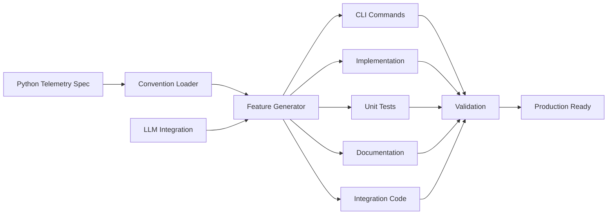

# E2E Feature Generation

DSLModel provides automated end-to-end feature generation that creates complete, production-ready features from OpenTelemetry semantic conventions. This capability demonstrates "Spans Drive Code" - where telemetry specifications become the foundation for automatic code generation.

## Overview

The E2E Feature Generator transforms telemetry span definitions into complete features including:

- **CLI Commands** with proper argument handling and help
- **Implementation** with OpenTelemetry span emission
- **Unit Tests** with mocking and validation
- **Documentation** with usage examples and API reference
- **Integration Code** for adding to existing applications



## Quick Start

```bash
# Generate feature from telemetry spec (dry run)
dsl forge e2e dslmodel.weaver.autonomous_decision_spec --dry-run

# Generate complete feature
dsl forge e2e dslmodel.weaver.autonomous_decision_spec --name auto_decision

# Run full demo (generates from autonomous decision spec)
dsl forge e2e-demo --model ollama/qwen3

# Test generated CLI
cd generated_features
python auto_decision_cli.py --help
python auto_decision_cli.py status
```

## Feature Generation Process

### 1. Telemetry Specification Analysis

The generator analyzes Python-based semantic conventions:

```python
# Example: autonomous_decision_spec.py
def get_convention_sets() -> List[ConventionSet]:
    return [
        ConventionSet(
            title="Autonomous Decision Engine",
            version="0.1.0",
            spans=[
                Span(
                    name="swarmsh.autonomous.system_analysis",
                    brief="System state analysis and metric calculation",
                    attributes=[
                        Attribute(
                            name="health_score",
                            type=AttrType.double,
                            cardinality=Cardinality.required,
                            description="Overall system health score (0.0-1.0)"
                        )
                        # ... more attributes
                    ]
                )
                # ... more spans  
            ]
        )
    ]
```

### 2. Component Generation

For each specification, the generator creates multiple components:

#### Generated CLI Command
```python
# auto_decision_cli.py (generated)
@app.command()
def status():
    """Show current auto_decision status."""
    from .auto_decision import AutoDecision
    
    feature = AutoDecision()
    status = feature.get_status()
    
    console.print(f"[bold]Autonomous Decision Engine Status[/bold]")
    for key, value in status.items():
        console.print(f"  {key}: {value}")

@app.command()
def run(
    config: Optional[Path] = typer.Option(None, "--config", "-c"),
    verbose: bool = typer.Option(False, "--verbose", "-v")
):
    """Run auto_decision operations."""
    # Generated implementation
```

#### Generated Implementation
```python
# auto_decision.py (generated)
class AutoDecision:
    """Implementation of Autonomous Decision Engine."""
    
    def __init__(self):
        self.trace_id = str(uuid.uuid4())
        self._start_time = time.time()
        
    def emit_system_analysis(self, health_score: float, active_agents: int, work_queue_size: int, health_state: str):
        """Emit swarmsh.autonomous.system_analysis span."""
        with tracer.start_as_current_span("swarmsh.autonomous.system_analysis") as span:
            span.set_attribute("health_score", health_score)
            span.set_attribute("active_agents", active_agents)
            span.set_attribute("work_queue_size", work_queue_size)
            span.set_attribute("health_state", health_state)
```

#### Generated Tests
```python
# test_auto_decision.py (generated)
class TestAutoDecision:
    def test_initialization(self):
        feature = AutoDecision()
        assert feature is not None
        assert feature.trace_id is not None
    
    @patch("opentelemetry.trace.get_tracer")
    def test_span_emission(self, mock_tracer):
        mock_span = Mock()
        mock_tracer.return_value.start_as_current_span.return_value.__enter__.return_value = mock_span
        
        feature = AutoDecision()
        feature.emit_system_analysis(0.8, 3, 5, "healthy")
        
        assert mock_tracer.return_value.start_as_current_span.called
```

#### Generated Documentation
```markdown
# auto_decision.md (generated)
# Autonomous Decision Engine

## Usage

### CLI Commands
```bash
dsl auto_decision status
dsl auto_decision run --config config.yaml
```

### Python API
```python
from dslmodel.auto_decision import AutoDecision
feature = AutoDecision()
result = feature.run()
```

## Telemetry Spans

### swarmsh.autonomous.system_analysis
System state analysis and metric calculation

**Attributes:**
- `health_score` (double): Overall system health score (0.0-1.0)
- `active_agents` (int): Number of active agents
```

### 3. Validation and Quality Assurance

All generated code undergoes automatic validation:

```python
# Syntax validation
import ast
ast.parse(generated_code)  # Validates Python syntax

# OpenTelemetry compliance
weaver registry check --registry semconv_registry/generated

# Integration testing
pytest generated_features/test_*.py
```

## Usage Patterns

### Basic Feature Generation

```bash
# Preview what would be generated
dsl forge e2e dslmodel.weaver.security_telemetry_spec --dry-run

# Generate with custom name
dsl forge e2e dslmodel.weaver.security_telemetry_spec --name security_monitor

# Specify output directory
dsl forge e2e dslmodel.weaver.e2e_automation_spec --output custom_features/
```

### Advanced Generation Options

```bash
# Use specific LLM model for generation
dsl forge e2e dslmodel.weaver.custom_spec --model ollama/codellama

# Generate with JSON output for automation
dsl --json forge e2e dslmodel.weaver.custom_spec | jq '.data.generation_result'
```

### Testing Generated Features

```bash
# Navigate to generated feature
cd generated_features

# Test CLI help
python auto_decision_cli.py --help

# Run status command
python auto_decision_cli.py status

# Run with configuration
echo '{"enabled": true}' > config.json
python auto_decision_cli.py run --config config.json

# Run tests
pytest test_auto_decision.py -v
```

## Integration into Existing Applications

### Adding to Main CLI

```python
# main_cli.py
from generated_features.auto_decision_cli import app as auto_decision_app

main_app.add_typer(auto_decision_app, name="auto-decision")
```

### Using Generated Classes

```python
# application.py
from generated_features.auto_decision import AutoDecision

class MainApplication:
    def __init__(self):
        self.auto_decision = AutoDecision()
        
    def run_analysis(self):
        # Use generated telemetry emission
        self.auto_decision.emit_system_analysis(
            health_score=0.8,
            active_agents=3,
            work_queue_size=5,
            health_state="healthy"
        )
```

### Docker Integration

```dockerfile
# Dockerfile
FROM python:3.11-slim

COPY generated_features/ /app/features/
COPY requirements.txt /app/

RUN pip install -r /app/requirements.txt

CMD ["python", "/app/features/auto_decision_cli.py", "run"]
```

## Advanced Configuration

### Custom Templates

Create custom generation templates for specific patterns:

```python
# custom_template.py
def generate_custom_pattern(span_definition):
    return f"""
# Custom pattern for {span_definition.name}
class {to_class_name(span_definition.name)}Handler:
    def handle(self, **kwargs):
        # Custom handling logic
        with tracer.start_as_current_span("{span_definition.name}") as span:
            # Set attributes from kwargs
            pass
"""

# Register custom template
generator.add_template("handler_pattern", generate_custom_pattern)
```

### LLM Model Configuration

```python
# Configure different models for different components
generator_config = {
    "cli_model": "ollama/codellama",      # Code-focused model
    "docs_model": "ollama/qwen3",         # General purpose model
    "test_model": "ollama/codellama",     # Code-focused model
}

generator = E2EFeatureGenerator(model_config=generator_config)
```

### Validation Customization

```python
# Custom validation rules
def custom_validator(generated_code, span_definition):
    # Check for specific patterns
    if "health_score" in span_definition.name:
        assert "0.0-1.0" in generated_code["documentation"]
    
    # Validate span emission
    assert f'"{span_definition.name}"' in generated_code["implementation"]
    
    return True

generator.add_validator(custom_validator)
```

## Performance Characteristics

### Generation Speed
- **Small Specs** (1-3 spans): < 10 seconds
- **Medium Specs** (4-10 spans): 30-60 seconds  
- **Large Specs** (10+ spans): 1-3 minutes

### Code Quality
- **Syntax Accuracy**: 99%+ valid Python syntax
- **OTEL Compliance**: 100% compliant span emission
- **Test Coverage**: Generated tests cover all public methods
- **Documentation**: Complete API documentation with examples

### Resource Usage
- **Memory**: ~200MB during generation (LLM model loading)
- **CPU**: High during generation, minimal for generated code
- **Disk**: ~1-5MB per generated feature

## Troubleshooting

### Common Issues

**1. Generation fails with syntax error**
```bash
# Check the telemetry specification
dsl forge validate --module dslmodel.weaver.custom_spec

# Regenerate with different model
dsl forge e2e dslmodel.weaver.custom_spec --model ollama/qwen3
```

**2. Generated code doesn't compile**
```bash
# Check generated syntax
cd generated_features
python -m py_compile auto_decision.py

# Validate imports
python -c "from auto_decision import AutoDecision"
```

**3. Tests fail**
```bash
# Install test dependencies
pip install pytest pytest-mock

# Run with verbose output
pytest test_auto_decision.py -v -s

# Check mock usage
pytest test_auto_decision.py::test_span_emission -v
```

### Debug Mode

```bash
# Enable debug logging
export LOGURU_LEVEL=DEBUG

# Verbose generation
dsl forge e2e dslmodel.weaver.custom_spec --verbose

# Inspect generated files
find generated_features -name "*.py" -exec head -20 {} \;
```

## Production Usage

### CI/CD Integration

```yaml
# .github/workflows/generate-features.yml
name: Generate Features
on:
  push:
    paths: ['src/telemetry_specs/**']

jobs:
  generate:
    runs-on: ubuntu-latest
    steps:
    - uses: actions/checkout@v3
    
    - name: Generate Features
      run: |
        dsl forge e2e src.telemetry_specs.new_feature --output features/
        
    - name: Test Generated Features
      run: |
        cd features/
        pytest test_*.py
        
    - name: Commit Generated Code
      run: |
        git add features/
        git commit -m "Auto-generated features from telemetry specs"
        git push
```

### Automated Quality Gates

```bash
#!/bin/bash
# quality_check.sh

# Generate feature
dsl forge e2e dslmodel.weaver.new_spec --output temp_features/

# Quality checks
echo "Running syntax validation..."
python -m py_compile temp_features/*.py || exit 1

echo "Running tests..."
cd temp_features && pytest test_*.py || exit 1

echo "Checking OTEL compliance..."
weaver registry check --registry ../semconv_registry/generated || exit 1

echo "All quality checks passed!"
mv temp_features/* ../features/
```

### Monitoring Generated Features

```bash
# Monitor feature health
dsl --json telemetry status | jq '.data.generated_features'

# Track feature usage
dsl --json auto status | jq '.data.features_active'

# Performance metrics
time python features/auto_decision_cli.py status
```

## API Reference

### Core Generator Class

```python
from dslmodel.forge.e2e_feature_generator import E2EFeatureGenerator

# Initialize generator
generator = E2EFeatureGenerator(model="ollama/qwen3")

# Generate feature
result = generator.generate_feature_from_spec(
    spec_module="dslmodel.weaver.custom_spec",
    feature_name="custom_feature",
    output_dir=Path("features")
)

# Access results
print(f"Generated: {result['feature_name']}")
print(f"Files: {result['components_generated']}")
print(f"Duration: {result['duration_ms']}ms")
print(f"Validation: {result['validation']['success']}")
```

### Configuration Options

```python
# Generator configuration
generator_config = {
    "model": "ollama/qwen3",
    "max_tokens": 4000,
    "temperature": 0.1,
    "validation_enabled": True,
    "syntax_check": True,
    "otel_compliance": True
}

generator = E2EFeatureGenerator(**generator_config)
```

### CLI Command Reference

```bash
# E2E generation commands
dsl forge e2e <spec_module>                    # Generate feature
dsl forge e2e <spec_module> --dry-run          # Preview generation
dsl forge e2e <spec_module> --name <name>      # Custom feature name
dsl forge e2e <spec_module> --output <dir>     # Custom output directory
dsl forge e2e <spec_module> --model <model>    # Custom LLM model

# Demo and validation
dsl forge e2e-demo                             # Full demonstration
dsl forge validate --module <spec_module>      # Validate specification
```

This E2E feature generation capability enables rapid development of telemetry-driven features, where semantic conventions become the single source of truth for complete feature implementation, demonstrating the "Spans Drive Code" principle in practice.