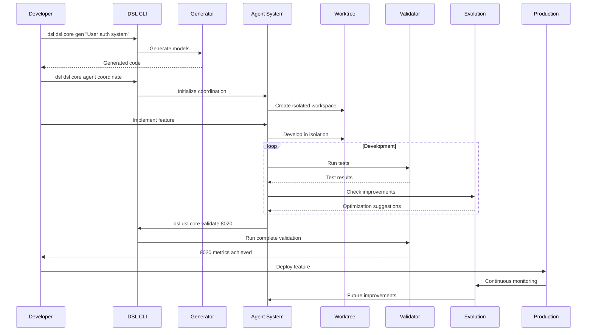
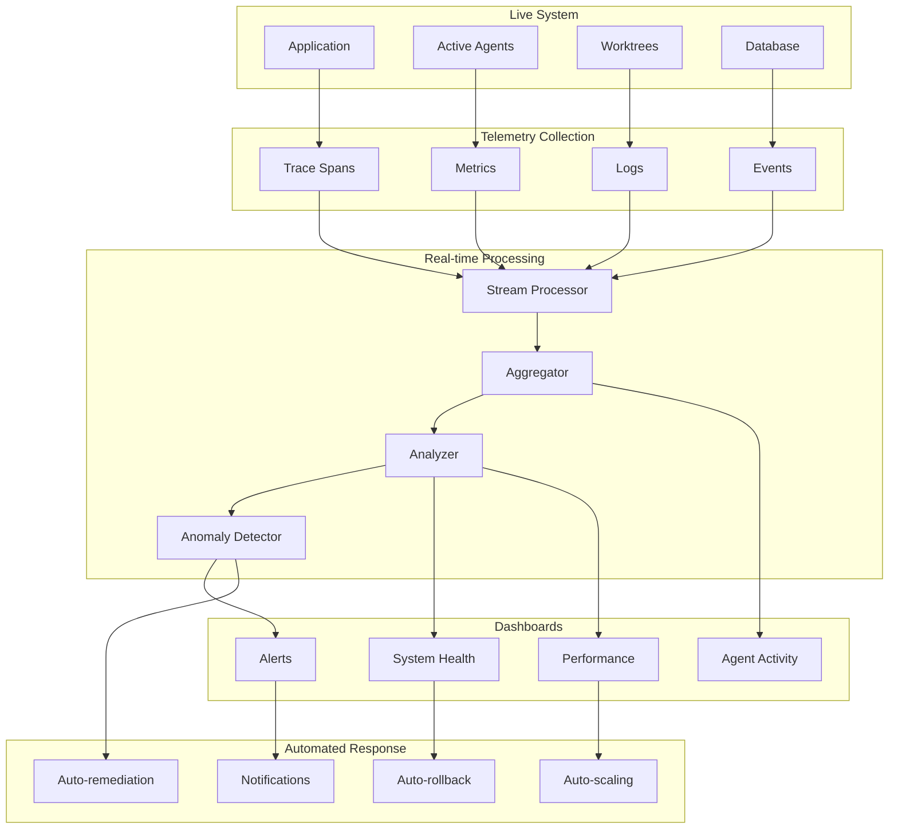
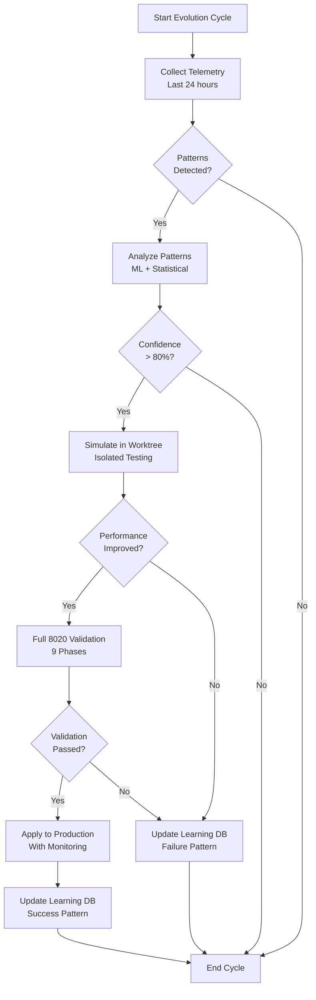
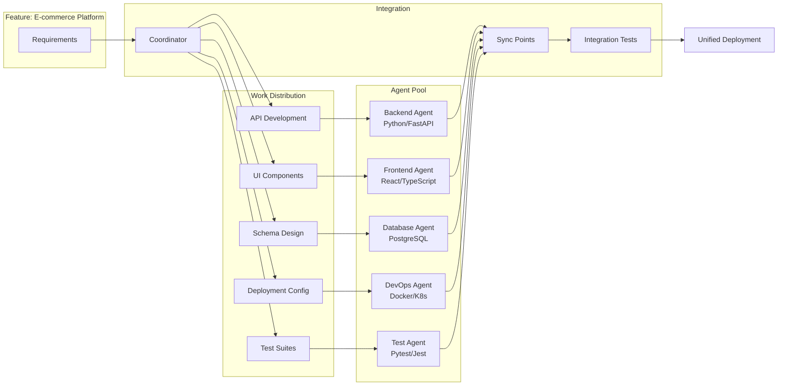
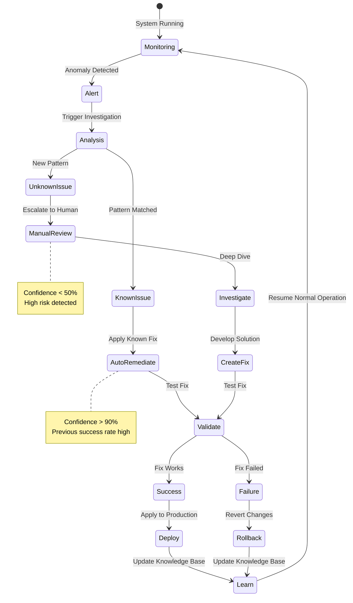
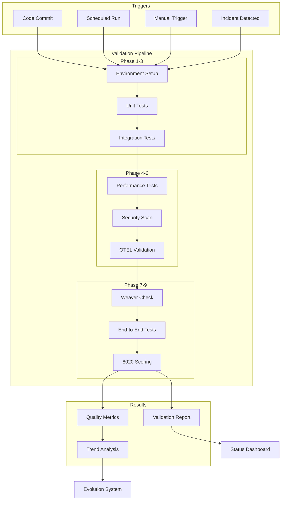
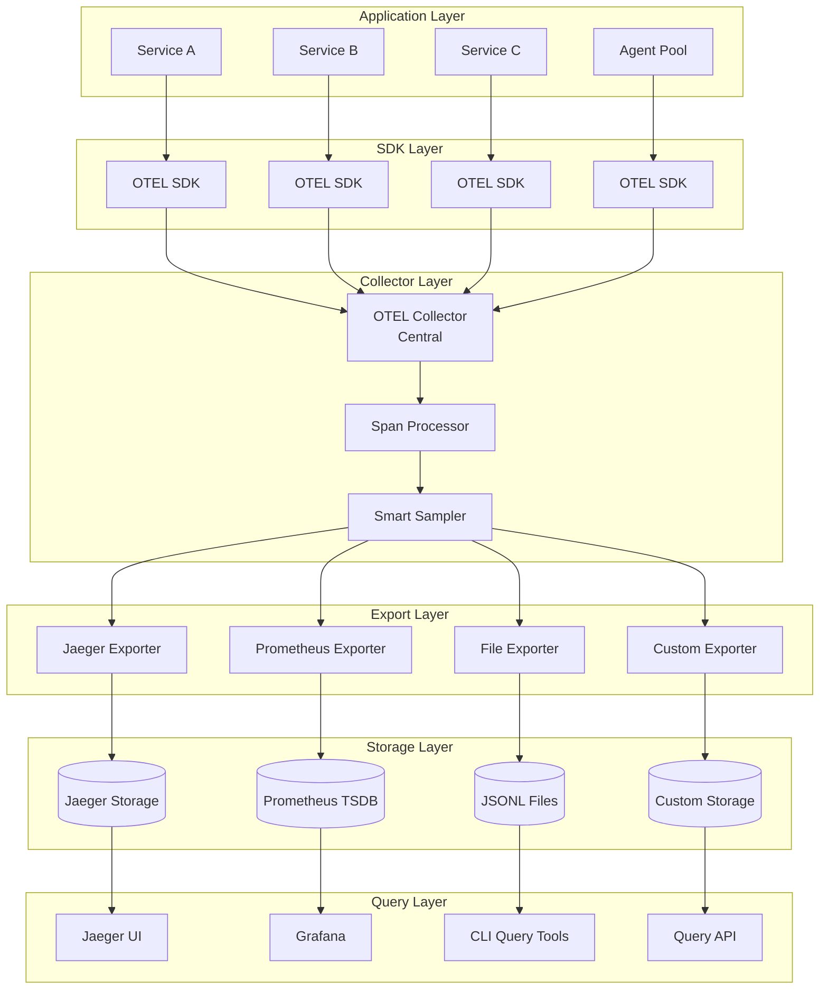
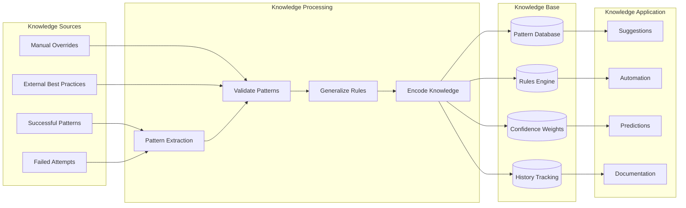
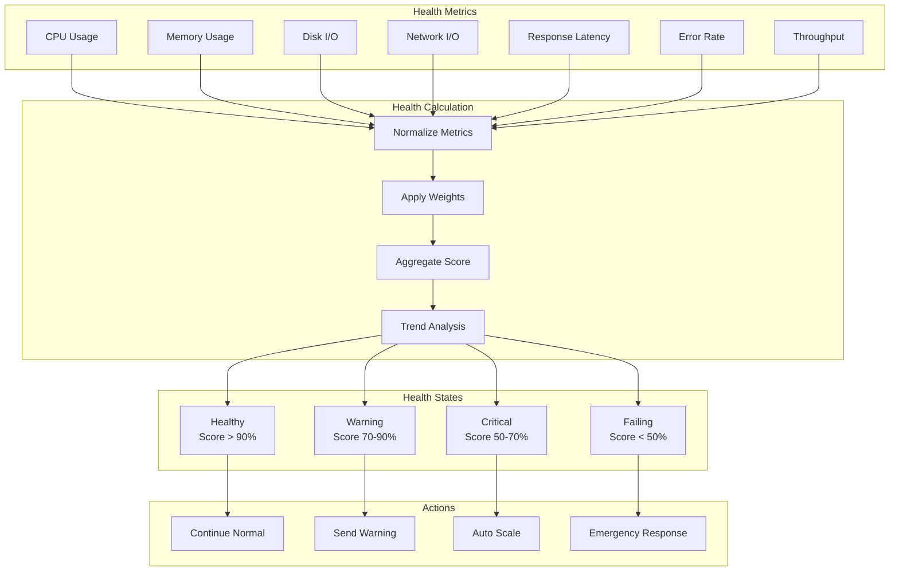

# DSLModel Operational Diagrams

## 1. Complete Feature Development Lifecycle

## 2. Real-time System Monitoring

## 3. Evolution Decision Making Process

## 4. Multi-Agent Collaboration

## 5. Incident Response Flow

## 6. Continuous Validation Loop

## 7. Generation to Production Pipeline

```mermaid
flowchart LR
    subgraph "Generation"
        PROMPT[Natural Language<br/>Prompt]
        LLM[LLM Processing<br/>Qwen/Groq]
        TEMPLATE[Template Engine<br/>Jinja2]
        CODE[Generated Code]
    end
    
    subgraph "Development"
        REVIEW[Code Review]
        ENHANCE[Enhancement]
        TEST_DEV[Testing]
    end
    
    subgraph "Validation"
        VALIDATE[8020 Validation]
        OTEL_VAL[OTEL Check]
        SECURITY_VAL[Security Scan]
    end
    
    subgraph "Deployment"
        STAGE[Staging]
        CANARY[Canary Deploy]
        PROD[Production]
    end
    
    PROMPT --> LLM
    LLM --> TEMPLATE
    TEMPLATE --> CODE
    
    CODE --> REVIEW
    REVIEW --> ENHANCE
    ENHANCE --> TEST_DEV
    
    TEST_DEV --> VALIDATE
    VALIDATE --> OTEL_VAL
    OTEL_VAL --> SECURITY_VAL
    
    SECURITY_VAL --> STAGE
    STAGE --> CANARY
    CANARY --> PROD
    
    PROD --> MONITOR[Continuous Monitoring]
    MONITOR --> EVOLUTION[Evolution Feedback]
    EVOLUTION --> PROMPT
```

## 8. OTEL Data Flow Architecture

## 9. Knowledge Transfer System

## 10. System Health Monitoring

