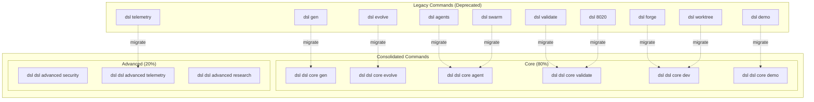
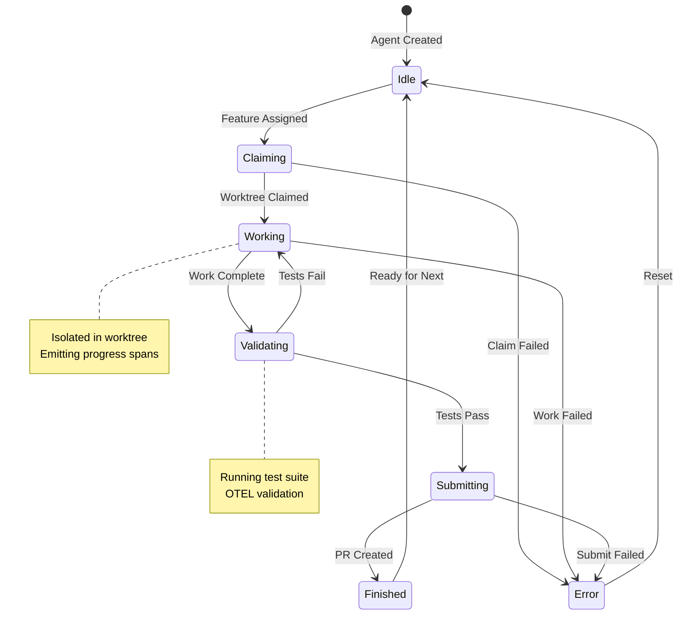
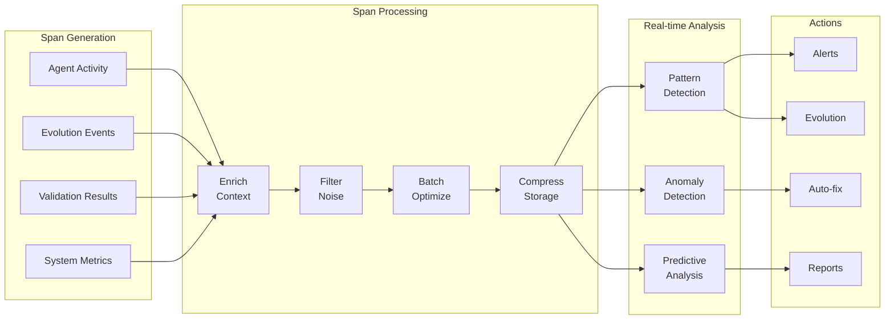
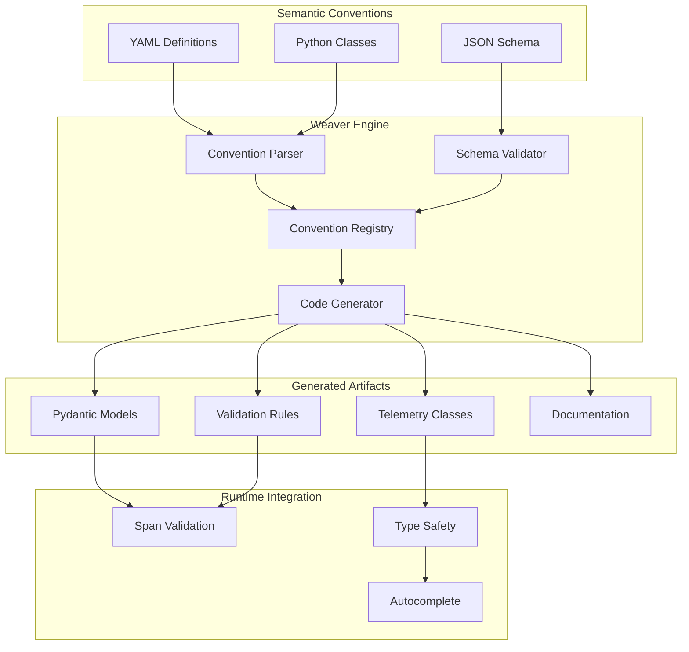
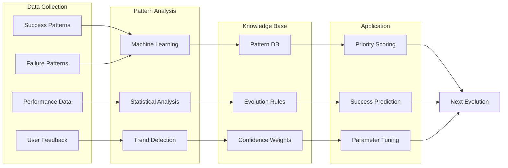
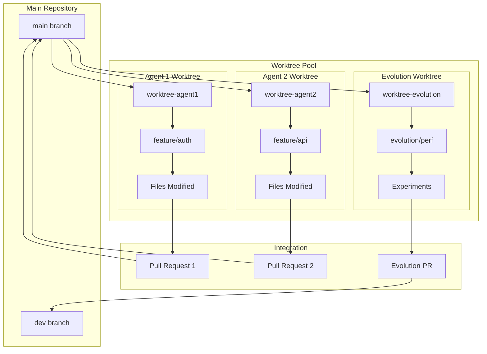
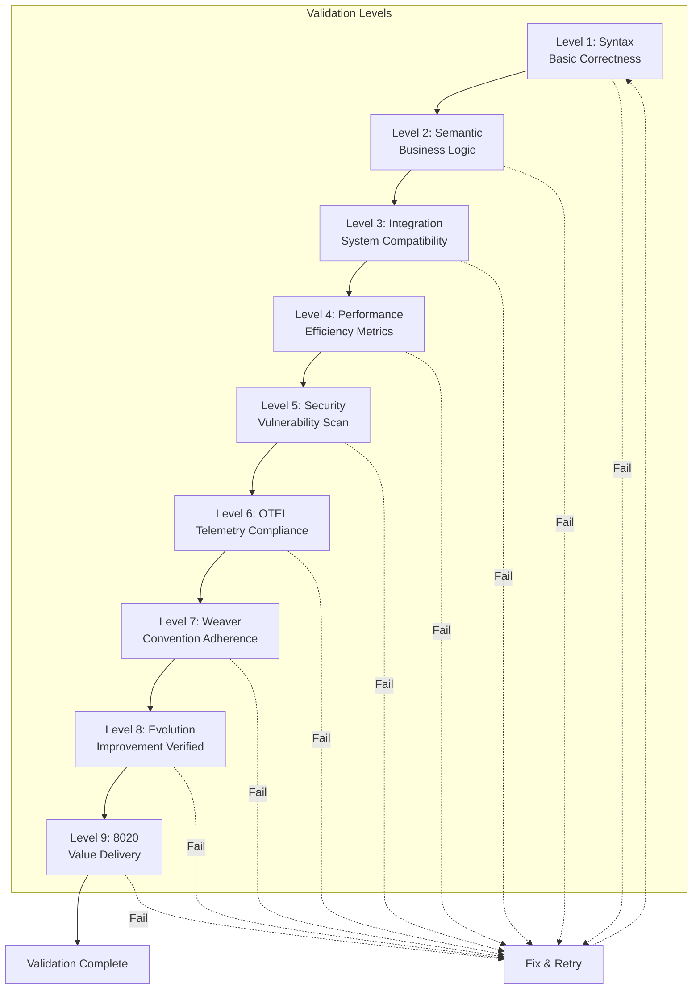
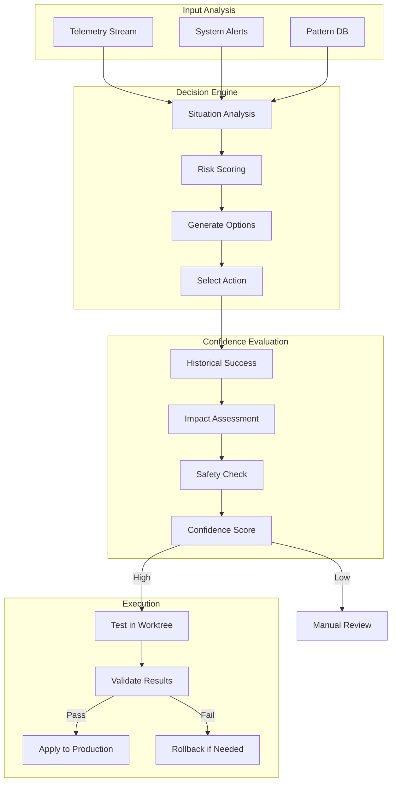
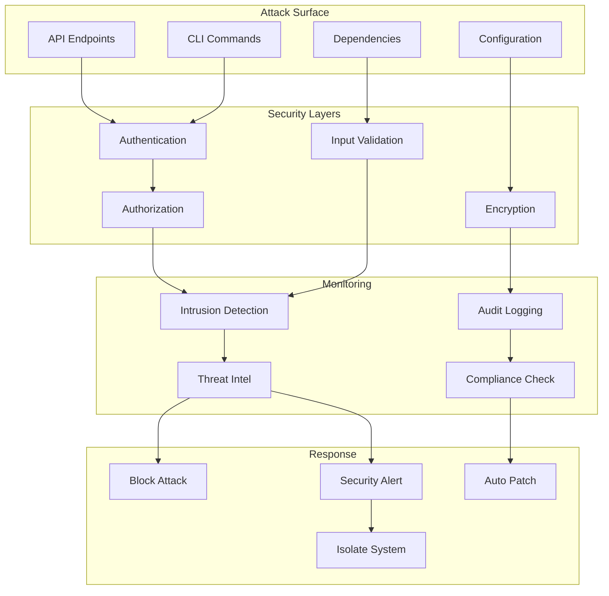
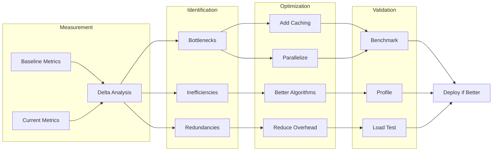

# DSLModel Subsystem Diagrams

## 1. Consolidated CLI Migration Path

## 2. Agent State Machine

## 3. Telemetry Flow Detail

## 4. Weaver Integration Architecture

## 5. Evolution Learning Cycle

## 6. Worktree Isolation Model

## 7. Validation Hierarchy

## 8. Autonomous Decision Flow

## 9. Security Architecture

## 10. Performance Optimization Pipeline

