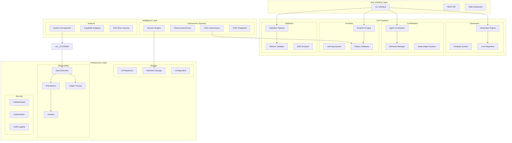
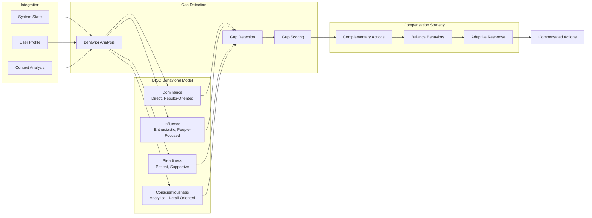
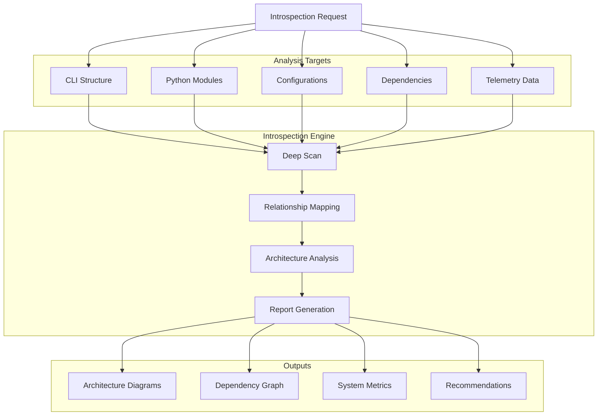
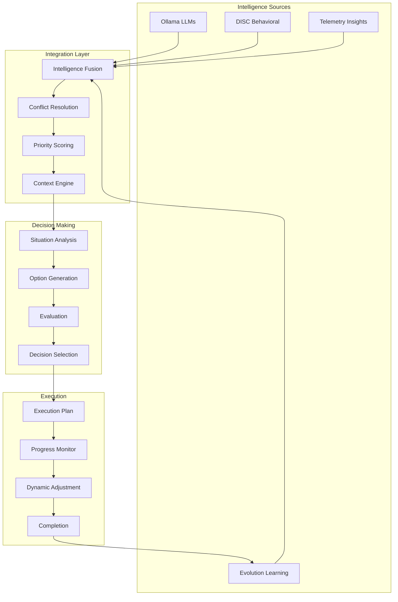
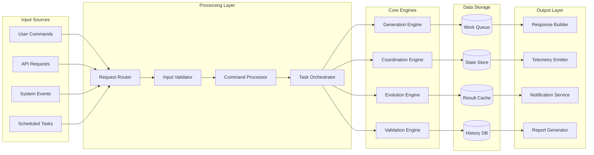
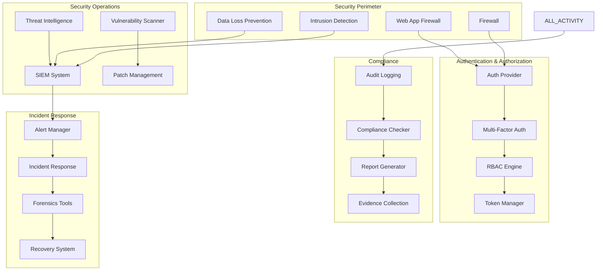
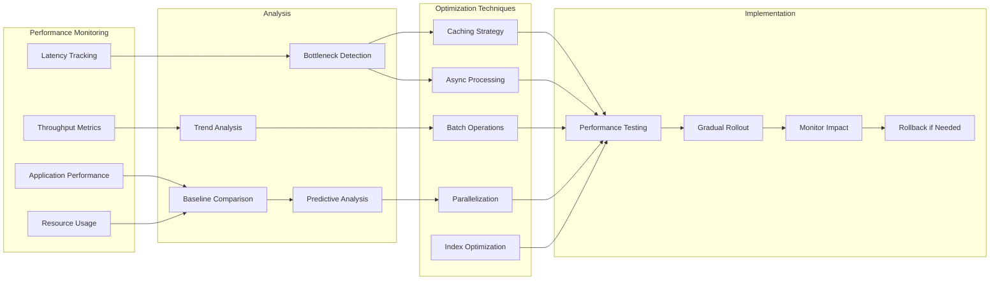
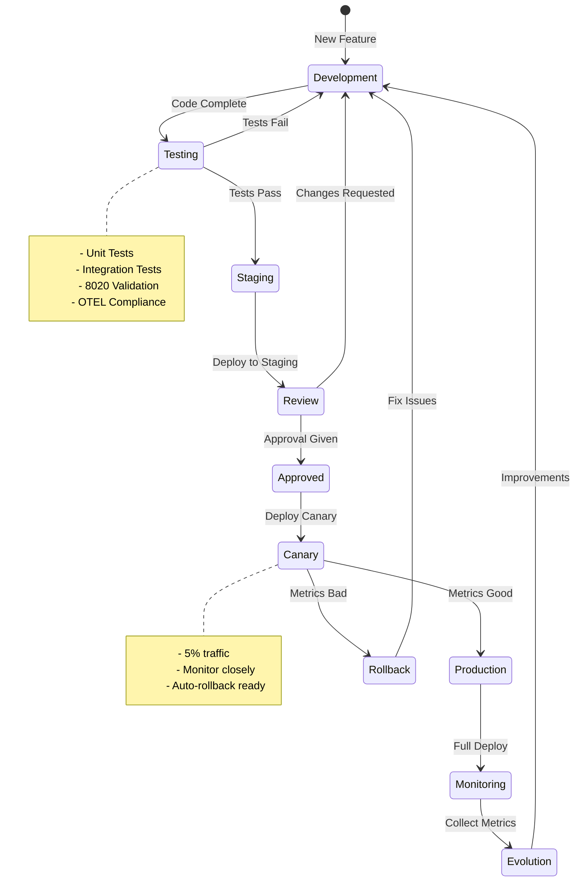
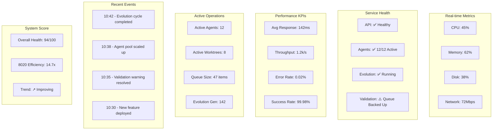

# DSLModel System Overview Diagrams

## 1. Complete System Architecture Overview

## 2. DISC Autonomous System Architecture

## 3. Consolidated CLI Command Hierarchy

```mermaid
graph TD
    ROOT[dsl]
    
    subgraph "Primary Interface"
        DSL[dsl dsl<br/>Consolidated Commands]
    end
    
    subgraph "Legacy Direct Access"
        GEN[gen]
        EVOLVE[evolve]
        AGENTS[agents]
        VALIDATE[validate]
        FORGE[forge]
        DEMO[demo]
    end
    
    subgraph "Advanced Systems"
        OLLAMA_AUTO[ollama-auto]
        DISC_AUTO[disc-auto]
        DISC_INTEGRATED[disc-integrated]
        INTROSPECT[introspect]
        REDTEAM[redteam]
    end
    
    subgraph "Specialized Tools"
        SWARM[swarm]
        WORKTREE[worktree]
        TELEMETRY[telemetry]
        WEAVER[weaver]
        THESIS[thesis]
    end
    
    ROOT --> DSL
    ROOT --> GEN
    ROOT --> EVOLVE
    ROOT --> AGENTS
    ROOT --> VALIDATE
    ROOT --> FORGE
    ROOT --> DEMO
    ROOT --> OLLAMA_AUTO
    ROOT --> DISC_AUTO
    ROOT --> DISC_INTEGRATED
    ROOT --> INTROSPECT
    ROOT --> REDTEAM
    ROOT --> SWARM
    ROOT --> WORKTREE
    ROOT --> TELEMETRY
    ROOT --> WEAVER
    ROOT --> THESIS
    
    DSL --> CORE[core<br/>80% Usage]
    DSL --> ADVANCED[advanced<br/>20% Usage]
    DSL --> STATUS[status]
    DSL --> MIGRATE[migrate]
```

## 4. System Introspection Flow

## 5. Integrated Intelligence Layer

## 6. Complete Data Flow Architecture

## 7. Security and Compliance Architecture

## 8. Performance Optimization Strategy

## 9. Development to Production Pipeline

## 10. System Health Dashboard View

