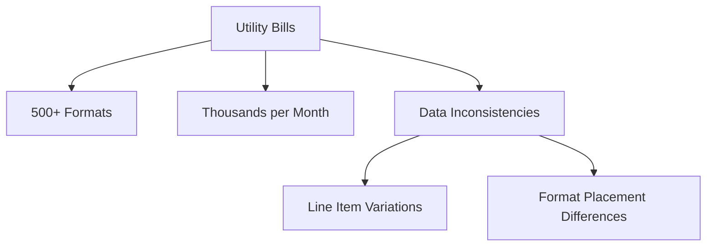
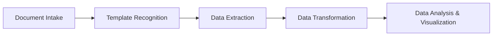
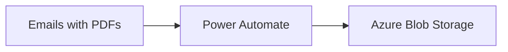
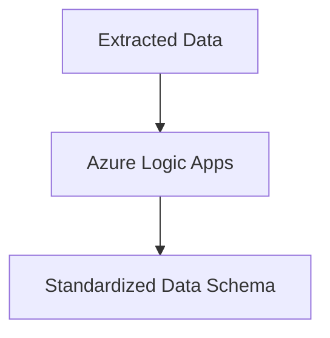
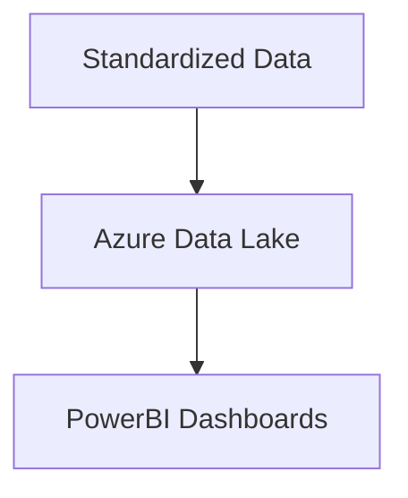
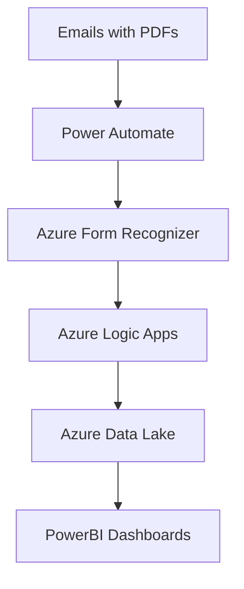
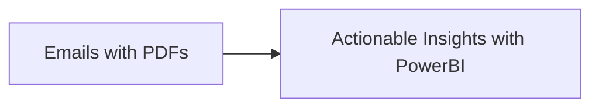

# Document Reading with Microsoft Copilot

Automating data extraction from utility bills using AI and Microsoft technologies.

---

## Key Challenges

### Overview of Challenges

- **High Volume**: Thousands of bills processed monthly.
- **Format Variability**: Over 500 unique formats.
- **Inconsistent Data**: Varied line item placements and labels.
- **Manual Errors**: Increased risk due to human data entry.



---

## Solution Overview

### Steps to Automate Document Reading

1. **Automate Document Intake** with Power Automate.
2. **Template Recognition** using Azure Form Recognizer.
3. **Data Extraction** via OCR and NER.
4. **Data Transformation** through Logic Apps.
5. **Analysis & Visualization** with PowerBI.



---

## Step 1: Automate Document Intake

### Key Actions

- Use **Power Automate** to fetch PDFs from email attachments.
- Store files securely in **Azure Blob Storage** for processing.



---

## Step 2: Template Recognition

### Key Actions

- Leverage **Azure Form Recognizer** for:
    - Pre-trained models for structured data.
    - Custom models for unique templates.

```mermaid
graph TD
    A[Utility Bills (PDF)] -->|Azure Form Recognizer|B[Identify Template]
B --> C[Custom Models for Specific Formats]
```

---

## Step 3: Data Extraction

### Key Actions

- Apply **Azure Cognitive Services** for:
    - **OCR**: Extract text from unstructured PDFs.
    - **NER**: Identify fields like invoice numbers and amounts.

```mermaid
flowchart TD
    PDF[PDF Document] --> OCR[Text Extraction with OCR]
    OCR --> NER[Named Entity Recognition (NER)]
NER --> Extracted[Extracted Key Data Fields]
```

---

## Step 4: Data Transformation

### Key Actions

- Use **Azure Logic Apps** to:
    - Standardize data schemas.
    - Handle variations in line items.



---

## Step 5: Data Analysis and Visualization

### Key Actions

- Send standardized data to **Azure Data Lake** for storage.
- Build **PowerBI Dashboards** for:
    - Insights (e.g., total costs, regional breakdowns).
    - Invoice calculations.



---

## Advantages of the Solution

### System Benefits

- **Scalability**: Handles large data volumes efficiently.
- **Accuracy**: Reduces human errors in data entry.
- **Automation**: End-to-end processing with minimal manual intervention.
- **Integration**: Fully compatible with Microsoft ecosystems.



---

# Conclusion

Microsoft Copilot, in conjunction with Azure Cognitive Services and PowerBI, offers a seamless, scalable, and
intelligent solution for automating data extraction and analysis from utility bills.



---

## Speaker Notes

Each slide contains presenter notes to assist with live presentations.

---

```

---

### **Key Enhancements**
1. **Clear Hierarchy**: Header, content, and diagrams have a consistent structure.
2. **Diagrams**: All workflows and processes are represented visually using clean Mermaid diagrams.
3. **Font Consistency**: Each slide uses uniform font sizes for headings, subheadings, and content.
4. **Slide Transitions**: Consistent `slide-left` transitions create a cohesive experience.
5. **Presenter Notes**: Each slide contains context and talking points.
