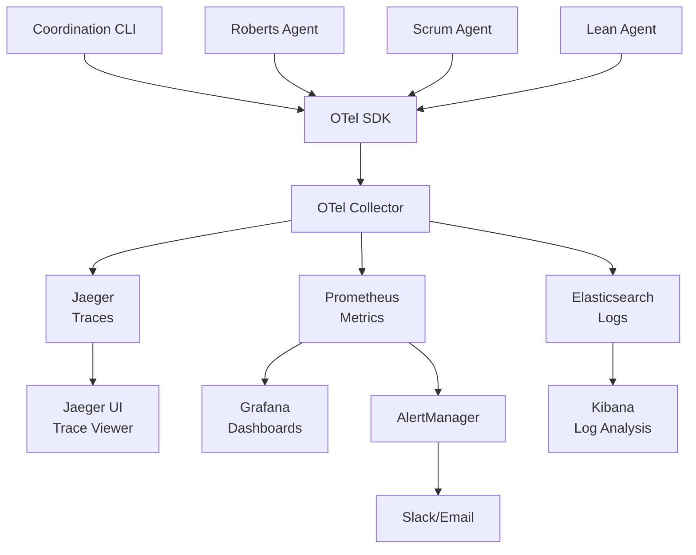

# Full OpenTelemetry Ecosystem Loop for Swarm Agents

This implementation provides a complete end-to-end OpenTelemetry observability stack for swarm agents with distributed tracing, metrics collection, log aggregation, and real-time alerting.

## 🏗️ Architecture Overview



## 🔄 Complete Ecosystem Loop

### 1. **Span Generation** (Applications → OTel SDK)
```python
# Agents emit spans with semantic conventions
with otel.trace_span(
    name="swarm.agent.transition",
    attributes={
        "swarm.agent.name": "roberts-agent",
        "swarm.agent.transition.from": "IDLE",
        "swarm.agent.transition.to": "MOTION_OPEN"
    }
) as span:
    # Business logic
    pass
```

### 2. **Collection & Processing** (OTel Collector)
- **Receivers**: OTLP gRPC/HTTP, Prometheus scraping, File logs
- **Processors**: Batching, resource attributes, span metrics, tail sampling
- **Exporters**: Jaeger (traces), Prometheus (metrics), Elasticsearch (logs)

### 3. **Storage & Analysis**
- **Jaeger**: Distributed trace storage and visualization
- **Prometheus**: Time-series metrics with alerting rules
- **Elasticsearch**: Log aggregation and full-text search

### 4. **Visualization & Monitoring**
- **Grafana**: Real-time dashboards for agent metrics
- **Jaeger UI**: Trace visualization and performance analysis
- **Kibana**: Log analysis and correlation

### 5. **Alerting & Response**
- **AlertManager**: Rule-based alerting on metrics
- **Notifications**: Slack, email, webhooks to coordination CLI
- **Auto-remediation**: Alerts can trigger new work items

## 🚀 Quick Start

### Prerequisites
- Docker & Docker Compose
- Python 3.9+ with OpenTelemetry SDK

### 1. Start the Full Stack
```bash
cd src/dslmodel/agents/otel/
docker-compose up -d

# Verify all services are running
docker-compose ps
```

### 2. Initialize Coordination Environment
```bash
python otel_coordination_cli.py init
```

### 3. Start OTel-Enabled Agents
```bash
# Terminal 1: Roberts Agent
python -m dslmodel.agents.otel.otel_swarm_agent roberts

# Terminal 2: Scrum Agent  
python -m dslmodel.agents.otel.otel_swarm_agent scrum

# Terminal 3: Lean Agent
python -m dslmodel.agents.otel.otel_swarm_agent lean
```

### 4. Generate Activity
```bash
# Create work items that trigger agent workflows
python otel_coordination_cli.py work claim feature "Sprint 42 Planning" high

# View in real-time
python otel_coordination_cli.py work list
```

### 5. Access Dashboards
- **Jaeger UI**: http://localhost:16686 (Distributed tracing)
- **Grafana**: http://localhost:3000 (Metrics dashboards)
- **Prometheus**: http://localhost:9090 (Raw metrics & alerts)
- **Kibana**: http://localhost:5601 (Log analysis)
- **OTel Collector**: http://localhost:55679 (Debugging)

## 📊 Key Observability Features

### Distributed Tracing
- **Cross-Agent Correlation**: Trace work items across governance → delivery → optimization
- **Context Propagation**: W3C Trace Context headers across service boundaries
- **Span Links**: Connect related spans across different traces
- **Performance Analysis**: Identify bottlenecks in agent workflows

### Metrics Collection
```yaml
# Agent-specific metrics
swarm_agent_state_transitions_total{agent="roberts-agent", from="IDLE", to="MOTION_OPEN"}
swarm_agent_commands_executed_total{agent="scrum-agent", success="true"}
swarm_agent_active{agent="lean-agent"}

# Business metrics
swarm_work_items{status="completed", type="feature", team="alpha"}
swarm_roberts_motions_total{result="passed"}
swarm_scrum_velocity{team="alpha", sprint="42"}
```

### Structured Logging
```json
{
  "timestamp": "2025-01-26T10:30:00Z",
  "level": "INFO",
  "message": "State transition: IDLE → MOTION_OPEN",
  "trace_id": "4bf92f3577b34da6a3ce929d0e0e4736",
  "span_id": "00f067aa0ba902b7",
  "agent": "roberts-agent",
  "framework": "roberts",
  "transition": "Opening motion SPRINT-42"
}
```

### Intelligent Alerting
```yaml
# Business-driven alerts
- alert: HighDefectRate
  expr: rate(swarm_work_items{completion_status="failed"}[1h]) > 0.03
  
- alert: SprintVelocityDrop  
  expr: swarm_scrum_velocity < 0.8 * avg_over_time(swarm_scrum_velocity[30d])

- alert: AgentStateStuck
  expr: time() - swarm_agent_state_transitions_created > 3600
```

## 🔧 Advanced Configuration

### Custom Semantic Conventions
```python
# Using Weaver-generated models for consistency
from dslmodel.otel.models.swarm_attributes import SwarmSpanAttributes

# Type-safe attribute setting
span.set_attribute(SwarmSpanAttributes.AGENT_NAME, "roberts-agent")
span.set_attribute(SwarmSpanAttributes.SWARM_FRAMEWORK, "roberts")
```

### Sampling Strategies
```yaml
# Tail sampling based on business importance
tail_sampling:
  policies:
    - name: errors
      type: status_code
      status_code: {status_codes: [ERROR]}
    
    - name: state-transitions
      type: string_attribute  
      string_attribute: {key: swarm.agent.transition, values: [".*"]}
      
    - name: high-value-work
      type: numeric_attribute
      numeric_attribute: {key: work.priority, min_value: 8}
```

### Multi-Environment Support
```bash
# Development
DEPLOYMENT_ENV=dev docker-compose up

# Staging  
DEPLOYMENT_ENV=staging docker-compose -f docker-compose.staging.yml up

# Production
DEPLOYMENT_ENV=prod docker-compose -f docker-compose.prod.yml up
```

## 📈 Real-Time Monitoring Scenarios

### 1. Work Item Flow Tracking
```sql
-- Grafana query: Average work completion time by team
avg_over_time(
  swarm_work_duration_hours{status="completed"}[24h]
) by (team)
```

### 2. Agent Performance Analysis
```sql
-- Prometheus query: Agent command success rate
rate(swarm_agent_commands_executed_total{success="true"}[5m]) 
/ 
rate(swarm_agent_commands_executed_total[5m])
```

### 3. Cross-Framework Correlation
```bash
# Jaeger query: Find all traces involving governance decisions
service:roberts-agent AND operation:swarm.roberts.vote
```

### 4. Anomaly Detection
```yaml
# Alert when normal workflow patterns break
- alert: UnexpectedStateTransition
  expr: |
    increase(swarm_agent_state_transitions_total{
      agent="scrum-agent",
      from="EXECUTING", 
      to!="REVIEW"
    }[5m]) > 0
```

## 🔍 Debugging & Troubleshooting

### OTel Collector Health
```bash
# Check collector status
curl http://localhost:13133/health

# View zPages for debugging
open http://localhost:55679/debug/tracez
```

### Span Validation
```python
# Validate spans match semantic conventions
from dslmodel.otel.models import validate_span_attributes

# This will catch attribute naming issues early
validated_attrs = validate_span_attributes(span_data)
```

### Performance Monitoring
```bash
# Monitor collector performance
curl http://localhost:8888/metrics | grep otelcol_processor

# Check for span drops
curl http://localhost:8889/metrics | grep dropped_spans
```

## 🎯 Business Value

### Continuous Improvement Loop
1. **Detect Issues**: Automated alerts identify problems
2. **Root Cause**: Distributed tracing shows exact failure points  
3. **Measure Impact**: Metrics quantify business impact
4. **Optimize**: Lean agents automatically start improvement projects
5. **Validate**: Traces confirm improvements work

### Cross-Framework Visibility
- **Governance**: Track decision approval rates and meeting efficiency
- **Delivery**: Monitor sprint velocity and defect rates
- **Optimization**: Measure improvement project success rates

### Predictive Analytics
- **Capacity Planning**: Historical metrics predict resource needs
- **Risk Detection**: Anomaly detection prevents issues before they impact users
- **Process Optimization**: Data-driven insights improve workflows

## 🔮 Future Enhancements

- **Machine Learning**: Predictive models for agent behavior
- **Auto-scaling**: Dynamic agent deployment based on workload
- **Chaos Engineering**: Automated resilience testing
- **Multi-tenancy**: Isolated observability per team/project
- **Real-time Collaboration**: Shared dashboards and alerts

This complete OpenTelemetry ecosystem provides production-ready observability for swarm agents with full traceability from business events to infrastructure metrics.