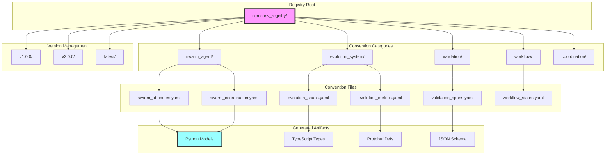
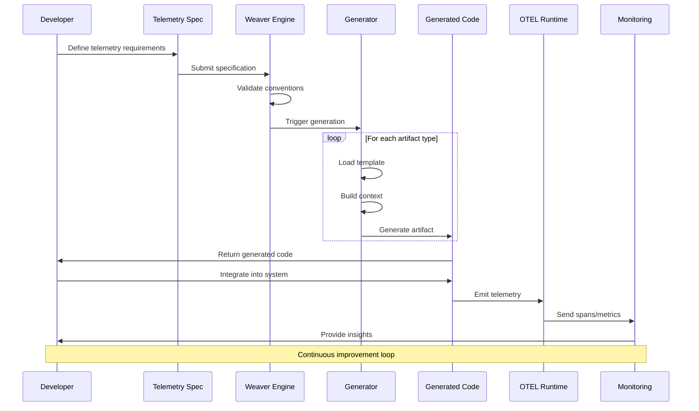
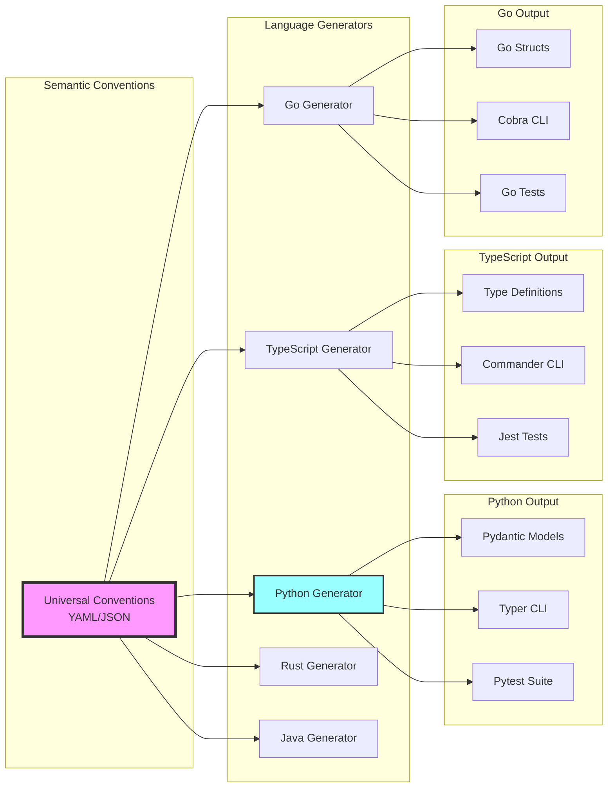
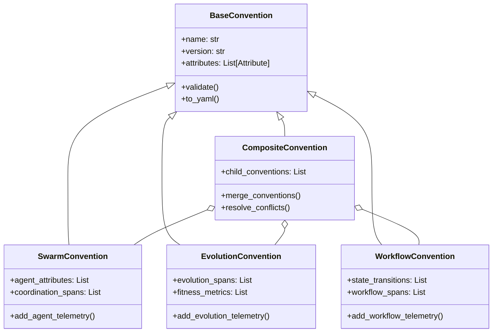
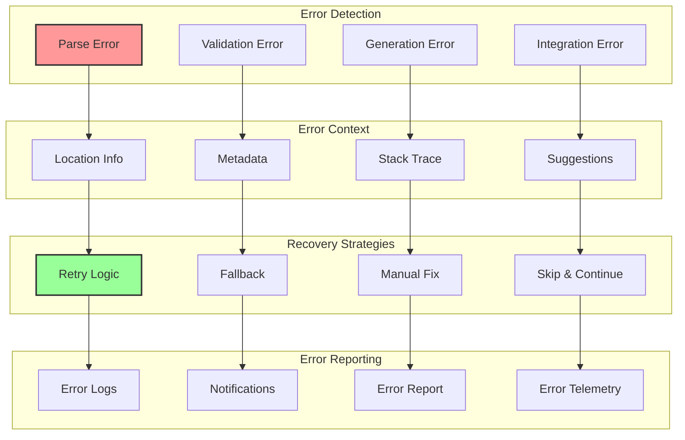
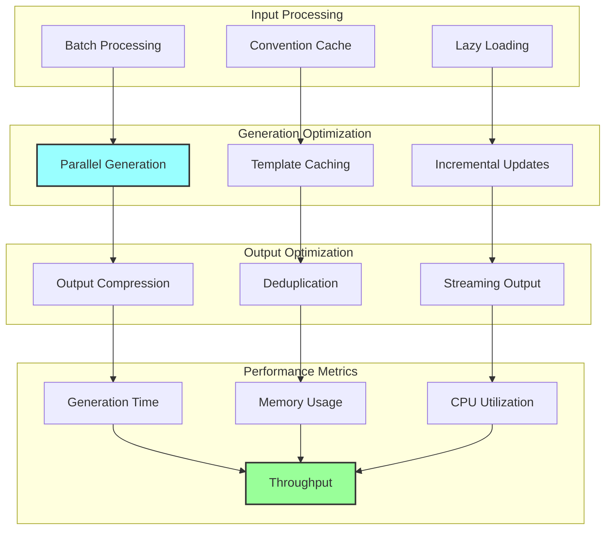
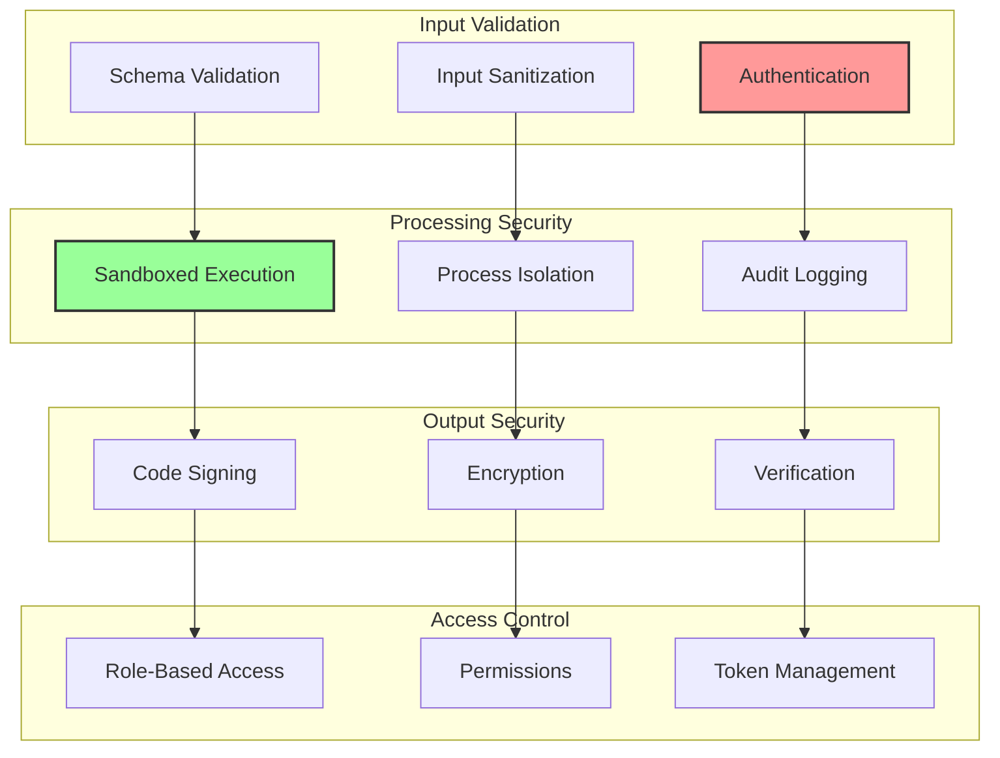
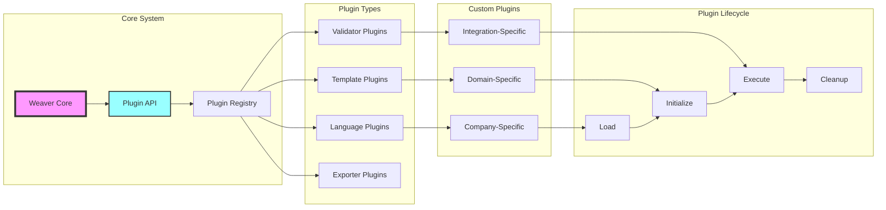
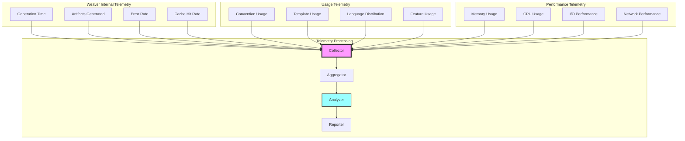
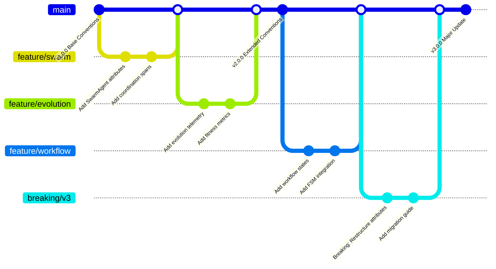

# Advanced Weaver Architecture Diagrams

## 11. Weaver Convention Registry Structure

## 12. Weaver-Driven Development Lifecycle

## 13. Weaver Multi-Language Support

## 14. Weaver Convention Inheritance

## 15. Weaver Error Handling and Recovery

## 16. Weaver Performance Optimization

## 17. Weaver Security Model

## 18. Weaver Plugin Architecture

## 19. Weaver Telemetry Collection

## 20. Weaver Convention Evolution

## Summary

These advanced diagrams illustrate:

1. **Registry Structure**: How conventions are organized and versioned
2. **Development Lifecycle**: The complete flow from spec to monitoring
3. **Multi-Language Support**: How Weaver generates for different languages
4. **Convention Inheritance**: Object-oriented convention design
5. **Error Handling**: Comprehensive error detection and recovery
6. **Performance Optimization**: Strategies for efficient generation
7. **Security Model**: Security measures throughout the pipeline
8. **Plugin Architecture**: Extensibility through plugins
9. **Telemetry Collection**: How Weaver itself is monitored
10. **Convention Evolution**: Version control and evolution of conventions

Together with the previous diagrams, this provides a complete visual representation of how Weaver is architected and integrated throughout the Claude Code (DSLModel) system, implementing the "Define Once, Generate Everything" philosophy with comprehensive telemetry-first development.