# Weaver Architecture Diagrams for Claude Code (DSLModel)

## 1. Weaver Architecture Overview

## 2. Weaver Forge Workflow

## 3. Semantic Convention Flow

## 4. Weaver-OTEL Integration

## 5. Weaver Validation Pipeline

```mermaid
flowchart LR
    subgraph "Input Data"
        SPANS[Telemetry Spans]
        CONV[Conventions]
        SCHEMA[Weaver Schema]
    end
    
    subgraph "Validation Engine"
        WV[Weaver Validator<br/>weaver_otel_validator.py]
        NRM[Normalizer]
        CV[Concurrent Validator]
        
        SPANS --> NRM
        NRM --> WV
        CONV --> WV
        SCHEMA --> WV
        WV --> CV
    end
    
    subgraph "Validation Types"
        SV[Schema Validation]
        AV[Attribute Validation]
        RV[Relationship Validation]
        PV[Performance Validation]
        
        CV --> SV
        CV --> AV
        CV --> RV
        CV --> PV
    end
    
    subgraph "Results Processing"
        RES[Validation Results]
        REP[Report Generator]
        META[Metadata Enrichment]
        
        SV --> RES
        AV --> RES
        RV --> RES
        PV --> RES
        
        RES --> META
        META --> REP
    end
    
    subgraph "Output"
        PASS[✅ Passed]
        FAIL[❌ Failed]
        WARN[⚠️ Warnings]
        PERF[📊 Performance]
        
        REP --> PASS
        REP --> FAIL
        REP --> WARN
        REP --> PERF
    end
    
    style WV fill:#f9f,stroke:#333,stroke-width:4px
    style RES fill:#9ff,stroke:#333,stroke-width:2px
```

## 6. Weaver Health Check System

## 7. Weaver Template System

## 8. Weaver E2E Feature Generation

## 9. Weaver-FSM Integration

## 10. Weaver Development Workflow

## Summary

These diagrams visualize the comprehensive Weaver integration in Claude Code (DSLModel):

1. **Architecture Overview**: Shows how Weaver Engine is the core that generates all artifacts
2. **Forge Workflow**: Illustrates the complete pipeline from specs to generated code
3. **Semantic Convention Flow**: Details how conventions are defined, processed, and used
4. **OTEL Integration**: Shows the deep integration between Weaver and OpenTelemetry
5. **Validation Pipeline**: Demonstrates the comprehensive validation system
6. **Health Check System**: Visualizes the monitoring and health verification flow
7. **Template System**: Shows how Jinja2 templates are used for code generation
8. **E2E Feature Generation**: Illustrates end-to-end feature creation from telemetry specs
9. **FSM Integration**: Shows state machine integration with observability
10. **Development Workflow**: Complete developer journey using Weaver

The Weaver system implements a "Define Once, Generate Everything" philosophy where OpenTelemetry semantic conventions drive the entire development process, ensuring consistency, type safety, and built-in observability across the Claude Code system.